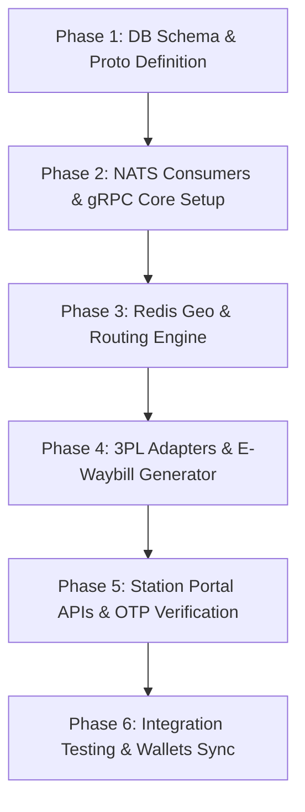

# WeMall — Cainiao-Style Delivery Service Architecture & Design Plan

This document outlines the architecture, database schema, routing algorithms, API definitions, and integration roadmap for the **WeMall Delivery Service**. 

Following the **Cainiao approach**, this service acts as a **decentralized logistics orchestrator/platform**. Rather than owning a physical fleet of delivery vehicles or employing a massive workforce, WeMall Delivery operates an asset-light, data-driven platform that integrates:
1. **Gig-Economy Couriers**: Crowd-sourced local riders and drivers.
2. **Third-Party Logistics (3PL)**: Commercial shipping partners (e.g., SF Express, DHL, FedEx) for long-haul and cross-border transport.
3. **WeMall Stations (驿站)**: Neighborhood pick-up/drop-off points operated by local convenience stores and small businesses.
4. **Peer-to-Peer Sending (WeMall Send / C2C)**: Open to individual consumers to send packages (with instant 2-hour pick-up by crowdsourced couriers or station drop-offs).

---

## 1. Architectural Overview

The Delivery Service sits behind the **API Gateway** (for client-facing GraphQL queries/mutations) and integrates into the **NATS JetStream** event bus to coordinate with other microservices (Order, Payment, Seller, and Notification Services).

```
                      ┌────────────────────────────────────────┐
                      │          API Gateway (GraphQL)         │
                      └────┬───────────────┬───────────────┬───┘
                           │               │               │
       (Buyer/Seller App)  │               │ (Courier App) │ (Station Portal)
                           ▼               ▼               ▼
       ┌───────────────────────┐ ┌───────────────┐ ┌───────────────┐
       │   Individual Users    │ │ Crowdsourced  │ │ WeMall Post   │
       │   & E-Commerce Sellers│ │   Couriers    │ │ Stations      │
       └───────────┬───────────┘ └───────┬───────┘ └───────┬───────┘
                   │                     │                 │
                   ▼                     ▼                 ▼
  ┌─────────────────────────────────────────────────────────────────┐
  │                 WeMall Delivery Service (Go)                    │
  │                                                                 │
  │  ┌──────────────────┐  ┌──────────────────┐  ┌───────────────┐  │
  │  │  Smart Routing   │  │   Geo-Matching   │  │   E-Waybill   │  │
  │  │  Dispatch Engine │  │   (Redis Geo)    │  │   Generator   │  │
  │  └────────┬─────────┘  └──────────────────┘  └───────┬───────┘  │
  └───────────┼──────────────────────────────────────────┼──────────┘
              │                                          │
              ▼ API Integrations                         ▼ Output
  ┌───────────────────────┐                    ┌──────────────────┐
  │ 3PL Carrier Webhooks  │                    │ Standard Thermal │
  │ & APIs (DHL, SF, etc) │                    │ E-Waybill (PDF)  │
  └───────────┬───────────┘                    └──────────────────┘
              │
              │ Webhook Status Callbacks
              ▼
  ┌────────────────────────┐
  │   HTTP Webhook Route   │
  └───────────┬────────────┘
              │
              ▼ Publishes Event
  ┌─────────────────────────────────────────────────────────────────┐
  │                      NATS JetStream Event Bus                   │
  │            (wemall.delivery.waybill_generated,                  │
  │             wemall.delivery.status_changed...)                  │
  └───────────────────────────────┬─────────────────────────────────┘
                                  │
                                  ▼ (JetStream Subscriber)
  ┌─────────────────────────────────────────────────────────────────┐
  │               Decoupled Services Integration                    │
  │                                                                 │
  │ ┌───────────────────────┐ ┌───────────────────┐ ┌─────────────┐ │
  │ │ Notification Service  │ │   Order Service   │ │ Chat Service│ │
  │ │  (Email/Push Alert)   │ │  (Status Sync)    │ │(Courier-User)│ │
  │ └───────────────────────┘ └───────────────────┘ └─────────────┘ │
  └─────────────────────────────────────────────────────────────────┘
```

### Key Cainiao Core Patterns
1. **Asset-Light Brokering**: Decouples logistics coordination from logistics asset ownership. All logistics providers are standardized under a single interface.
2. **Unified Tracking Status**: Tracking events from 3PLs, stations, and crowdsourced couriers are mapped to a standardized lifecycle (e.g., `PICKED_UP`, `IN_TRANSIT`, `ARRIVED_AT_STATION`, `OUT_FOR_DELIVERY`, `DELIVERED`).
3. **Smart Dispatching**: Dynamically assigns deliveries based on distance, cost, weight, and carrier availability.
4. **Waybill Abstraction**: Instead of using different formats for different carriers, WeMall issues a single, standard **E-Waybill** with multi-routing sections (Sorting Code, 3PL Barcode, WeMall Station code).
5. **Community Station Mesh**: Leverages existing brick-and-mortar storefronts (convenience stores, local pharmacies) to host package storage. This drastically reduces last-mile delivery failure rates.

---

## 2. Database Schema (`wemall_delivery`)

The Delivery Service owns its dedicated schema. The schema supports independent gig couriers (with real-time geolocation tracking), 3PL logistics configurations, physical station parameters, shelf layout, and tracking timelines.

```sql
-- Enable PostGIS extension for advanced geolocation query capabilities
CREATE EXTENSION IF NOT EXISTS postgis;

-- Create Enums for Delivery statuses, routing, and carrier types
CREATE TYPE delivery_status AS ENUM (
    'created',              -- Shipping order created, awaiting payment/assignment
    'assigned',             -- Courier or 3PL partner assigned
    'awaiting_pickup',      -- Ready at origin for courier/3PL pickup
    'picked_up',            -- Package collected by courier/carrier
    'in_transit',           -- package is on route through logistics network
    'arrived_at_station',   -- Package waiting at a local WeMall Station
    'out_for_delivery',     -- Courier is delivering to customer door
    'delivered',            -- Safely signed off / delivered
    'failed',               -- Delivery attempt failed
    'returned'              -- Package returned to origin
);

CREATE TYPE delivery_type AS ENUM (
    'door_to_door',         -- Courier picks up at door, delivers to door
    'station_to_door',      -- Sender drops at station, courier delivers to door
    'door_to_station',      -- Courier picks at door, delivers to station
    'station_to_station'    -- Sender drops at station, recipient picks at station
);

CREATE TYPE carrier_type AS ENUM (
    'crowdsourced',         -- Gig-economy independent rider
    '3pl'                   -- External shipping company (e.g., DHL, SF Express)
);

CREATE TYPE courier_status AS ENUM (
    'pending',              -- Under registration review
    'approved',             -- Approved, can go online
    'rejected',             -- Verification failed
    'suspended'             -- Restricted due to rating/policy violation
);

CREATE TYPE station_status AS ENUM (
    'pending',
    'active',
    'suspended'
);

CREATE TYPE station_package_direction AS ENUM (
    'inbound_for_buyer',    -- Package arrived from transit, waiting for buyer pickup
    'outbound_for_courier'  -- Dropped off by seller/user, waiting for courier transport
);

-- 1. Logistics Partners (3PL Companies)
CREATE TABLE logistics_partners (
    id             UUID          PRIMARY KEY DEFAULT gen_random_uuid(),
    name           VARCHAR(100)  NOT NULL,
    code           VARCHAR(20)   NOT NULL UNIQUE,        -- e.g., 'sf_express', 'dhl', 'fedex'
    api_endpoint   VARCHAR(255)  NOT NULL,
    api_key        TEXT          NOT NULL,
    is_active      BOOLEAN       NOT NULL DEFAULT TRUE,
    pricing_schema JSONB         NOT NULL,               -- Base price + price/kg formulas
    created_at     TIMESTAMPTZ   NOT NULL DEFAULT NOW(),
    updated_at     TIMESTAMPTZ   NOT NULL DEFAULT NOW()
);

-- 2. Crowdsourced Couriers (Gig Riders)
CREATE TABLE couriers (
    id                  UUID            PRIMARY KEY DEFAULT gen_random_uuid(),
    user_id             UUID            NOT NULL UNIQUE,        -- Link to Users DB
    vehicle_type        VARCHAR(20)     NOT NULL,               -- 'bicycle', 'motorcycle', 'car', 'van'
    plate_number        VARCHAR(20),
    is_online           BOOLEAN         NOT NULL DEFAULT FALSE, -- Available for tasks
    verification_status courier_status  NOT NULL DEFAULT 'pending',
    rating              DECIMAL(3,2)    NOT NULL DEFAULT 5.00,
    current_location    GEOMETRY(Point, 4326),                  -- Real-time location (SRID 4326)
    wallet_balance      DECIMAL(12,2)   NOT NULL DEFAULT 0.00,  -- Earnings balance
    created_at          TIMESTAMPTZ     NOT NULL DEFAULT NOW(),
    updated_at          TIMESTAMPTZ     NOT NULL DEFAULT NOW()
);
CREATE INDEX idx_couriers_location ON couriers USING GIST(current_location);
CREATE INDEX idx_couriers_online ON couriers(is_online) WHERE is_online = TRUE;

-- 3. WeMall Stations (驿站 Hubs)
CREATE TABLE stations (
    id                   UUID            PRIMARY KEY DEFAULT gen_random_uuid(),
    keeper_user_id       UUID            NOT NULL,               -- Shop owner User ID
    name                 VARCHAR(100)    NOT NULL,
    store_type           VARCHAR(50)     NOT NULL,               -- 'convenience_store', 'dry_cleaner'
    phone                VARCHAR(20)     NOT NULL,
    address_line1        TEXT            NOT NULL,
    city                 VARCHAR(100)    NOT NULL,
    country              VARCHAR(100)    NOT NULL,
    location             GEOMETRY(Point, 4326) NOT NULL,
    status               station_status  NOT NULL DEFAULT 'pending',
    capacity_packages    INTEGER         NOT NULL DEFAULT 500,
    current_package_count INTEGER        NOT NULL DEFAULT 0,
    operating_hours      JSONB           NOT NULL,               -- e.g., {"mon-fri": "08:00-21:00"}
    created_at           TIMESTAMPTZ     NOT NULL DEFAULT NOW(),
    updated_at           TIMESTAMPTZ     NOT NULL DEFAULT NOW()
);
CREATE INDEX idx_stations_location ON stations USING GIST(location);
CREATE INDEX idx_stations_city ON stations(city);

-- 4. Delivery Orders (The Waybill Manifest)
CREATE TABLE delivery_orders (
    id                     UUID            PRIMARY KEY DEFAULT gen_random_uuid(),
    tracking_number        VARCHAR(50)     NOT NULL UNIQUE,        -- e.g., WM-482048-2849
    order_id               UUID,                                   -- Optional (NULL for C2C send)
    sender_type            VARCHAR(20)     NOT NULL,               -- 'seller' | 'individual'
    sender_id              UUID            NOT NULL,               -- User ID or Store ID
    
    -- Sender Details
    sender_name            VARCHAR(100)    NOT NULL,
    sender_phone           VARCHAR(20)     NOT NULL,
    sender_address_line1   TEXT            NOT NULL,
    sender_city            VARCHAR(100)    NOT NULL,
    sender_country         VARCHAR(100)    NOT NULL,
    sender_location        GEOMETRY(Point, 4326) NOT NULL,
    
    -- Recipient Details
    recipient_name          VARCHAR(100)    NOT NULL,
    recipient_phone         VARCHAR(20)     NOT NULL,
    recipient_address_line1 TEXT            NOT NULL,
    recipient_city          VARCHAR(100)    NOT NULL,
    recipient_country       VARCHAR(100)    NOT NULL,
    recipient_location      GEOMETRY(Point, 4326) NOT NULL,
    
    -- Routing Configuration
    delivery_type          delivery_type   NOT NULL,
    origin_station_id      UUID,                                   -- Present if dropped at station
    destination_station_id UUID,                                   -- Present if picked up at station
    
    -- Carrier Match
    carrier_type           carrier_type,                           -- Assigned matching type
    carrier_partner_id     UUID,                                   -- References logistics_partners
    carrier_courier_id     UUID,                                   -- References couriers
    external_tracking_no   VARCHAR(100),                           -- 3PL tracking ID (e.g. DHL code)
    
    -- Parcel Metadata
    weight_kg              DECIMAL(10,2)   NOT NULL DEFAULT 1.00,
    dimensions_cm          JSONB           NOT NULL,               -- {"length": 20, "width": 15, "height": 10}
    shipping_fee           DECIMAL(10,2)   NOT NULL,
    payment_status         VARCHAR(20)     NOT NULL DEFAULT 'pending', -- 'pending' | 'paid' | 'refunded'
    
    -- Status and Timestamps
    status                 delivery_status NOT NULL DEFAULT 'created',
    created_at             TIMESTAMPTZ     NOT NULL DEFAULT NOW(),
    updated_at             TIMESTAMPTZ     NOT NULL DEFAULT NOW(),
    picked_up_at           TIMESTAMPTZ,
    delivered_at           TIMESTAMPTZ
);
CREATE INDEX idx_delivery_orders_tracking ON delivery_orders(tracking_number);
CREATE INDEX idx_delivery_orders_status ON delivery_orders(status);
CREATE INDEX idx_delivery_orders_order_id ON delivery_orders(order_id);
CREATE INDEX idx_delivery_orders_courier ON delivery_orders(carrier_courier_id) WHERE carrier_type = 'crowdsourced';

-- 5. Courier Dispatch Tasks (Bidding / Broadcast Log)
CREATE TABLE courier_tasks (
    id                 UUID            PRIMARY KEY DEFAULT gen_random_uuid(),
    delivery_order_id  UUID            NOT NULL REFERENCES delivery_orders(id),
    courier_id         UUID            NOT NULL REFERENCES couriers(id),
    status             VARCHAR(20)     NOT NULL DEFAULT 'offered', -- 'offered' | 'accepted' | 'rejected' | 'expired'
    offered_at         TIMESTAMPTZ     NOT NULL DEFAULT NOW(),
    responded_at       TIMESTAMPTZ,
    UNIQUE(delivery_order_id, courier_id)
);
CREATE INDEX idx_courier_tasks_status ON courier_tasks(courier_id, status);

-- 6. Station Packages (Package physical tracking inside Stations)
CREATE TABLE station_packages (
    id                 UUID            PRIMARY KEY DEFAULT gen_random_uuid(),
    station_id         UUID            NOT NULL REFERENCES stations(id),
    delivery_order_id  UUID            NOT NULL UNIQUE REFERENCES delivery_orders(id),
    direction          station_package_direction NOT NULL,
    shelf_code         VARCHAR(20)     NOT NULL,               -- Physical location, e.g., 'Row-B3'
    verification_code  VARCHAR(8)      NOT NULL,               -- High-entropy verification OTP for pickup
    check_in_at        TIMESTAMPTZ     NOT NULL DEFAULT NOW(),
    check_in_by        UUID            NOT NULL,               -- Operator User ID
    check_out_at       TIMESTAMPTZ,
    check_out_by       UUID,                                   -- Recipient or Courier User ID
    created_at         TIMESTAMPTZ     NOT NULL DEFAULT NOW()
);
CREATE INDEX idx_station_packages_unclaimed ON station_packages(station_id) WHERE check_out_at IS NULL;

-- 7. Tracking Logs (Audit trail & user-facing chronological timeline)
CREATE TABLE tracking_logs (
    id                 UUID            PRIMARY KEY DEFAULT gen_random_uuid(),
    delivery_order_id  UUID            NOT NULL REFERENCES delivery_orders(id),
    status             delivery_status NOT NULL,
    location_desc      TEXT            NOT NULL,               -- e.g., "Arrived at WeMall Post Station [Greenwood Branch]"
    coordinate         GEOMETRY(Point, 4326),                  -- Geo-location of update
    details            TEXT,                                   -- Custom tracking notes
    operator_id        UUID,                                   -- User ID of Courier, Station Keeper, or system/3PL id
    created_at         TIMESTAMPTZ     NOT NULL DEFAULT NOW()
);
CREATE INDEX idx_tracking_logs_order ON tracking_logs(delivery_order_id, created_at DESC);
```

---

## 3. System Integration & Service Linkages

To deliver a cohesive Cainiao experience, the Delivery Service links directly with WeMall's existing microservices:

```
┌─────────────────┐       1. Check Out Order & Pays Shipping Fee
│  Order Service  ├─────────────────────────────────────────────┐
└─────────────────┘                                             │
                                                                ▼
┌─────────────────┐       2. Process Shipping Fee Payment   ┌───┴───────────────┐
│ Payment Service ├────────────────────────────────────────►│  Delivery Service │
└─────────────────┘                                         └───┬───────────────┘
                                                                │
┌─────────────────┐       3. Query Address Book / Geo-Locs      │
│  User Service   │◄────────────────────────────────────────────┤
└─────────────────┘                                             │
                                                                │ 4. Publishes Status Change
                                                                ▼
┌─────────────────┐       5. Sends Push Alert / Email Receipt ┌─┴───────────────┐
│Notification Serv│◄──────────────────────────────────────────┤  NATS JetStream │
└─────────────────┘                                           └─┬───────────────┘
                                                                │
┌─────────────────┐       6. Connects Courier and Customer      │
│  Chat Service   │◄────────────────────────────────────────────┘
└─────────────────┘
```

1. **Order Service Linkage**:
   - **E-Commerce Checkout**: When a Buyer checks out, the Order Service requests shipping tiers and rates from the Delivery Service based on merchant and buyer addresses.
   - **Order Fulfillment Sync**: Once an order is paid, the Order Service publishes `wemall.order.paid`. The Delivery Service consumes this, generates an E-Waybill, assigns a carrier, and publishes back a `wemall.delivery.created` event containing the tracking ID.
2. **User Service Linkage**:
   - **Identity & Profiles**: The Delivery Service validates user roles (`BUYER`, `SELLER`). It retrieves verified addresses, phone numbers, and coordinates from the User Service's profile module.
   - **Courier Credentials**: gig couriers are verified using the User Service's KYC system before being approved.
3. **Payment Service Linkage**:
   - **C2C Shipping Fee**: For individual users sending packages, the Delivery Service calculates shipping fees, coordinates with the Payment Service to create an invoice, and processes payments.
   - **Courier Wallet Payments**: Once a courier delivers a crowdsourced package, the Delivery Service issues a gRPC payout request to the Payment Service, which credits the courier's digital wallet and handles escrow releases.
4. **Notification Service Linkage**:
   - **Tracking Updates**: The Delivery Service emits NATS JetStream events for every tracking milestone (e.g. `wemall.delivery.picked_up`, `wemall.delivery.arrived_at_station`). The Notification Service listens and triggers instant SMS/push notifications (e.g., "Your package has arrived at Station A-101. Use pickup code 983210 to collect it").
5. **Chat Service Linkage**:
   - **Courier-Customer Hotline**: For last-mile crowdsourced deliveries, the API Gateway provisions a temporary chat room inside the Chat Service. The Courier and Recipient can message each other directly (e.g., "I'm leaving the package at the reception") without exposing personal phone numbers.

---

## 4. API Design

### GraphQL API Extensions (API Gateway)

These schemas will be added to the Gateway to support the three key interfaces (Consumers/Sellers, Couriers, and Station Keepers).

```graphql
# --- 1. Shared Types ---
enum DeliveryStatus {
  CREATED
  ASSIGNED
  AWAITING_PICKUP
  PICKED_UP
  IN_TRANSIT
  ARRIVED_AT_STATION
  OUT_FOR_DELIVERY
  DELIVERED
  FAILED
  RETURNED
}

enum DeliveryType {
  DOOR_TO_DOOR
  STATION_TO_DOOR
  DOOR_TO_STATION
  STATION_TO_STATION
}

type Location {
  latitude: Float!
  longitude: Float!
}

input LocationInput {
  latitude: Float!
  longitude: Float!
}

type DeliveryOrder {
  id: ID!
  trackingNumber: String!
  orderId: ID
  senderName: String!
  senderPhone: String!
  recipientName: String!
  recipientPhone: String!
  deliveryType: DeliveryType!
  originStation: Station
  destinationStation: Station
  weightKg: Float!
  shippingFee: Float!
  status: DeliveryStatus!
  trackingLogs: [TrackingLog!]!
  createdAt: String!
}

type TrackingLog {
  id: ID!
  status: DeliveryStatus!
  locationDesc: String!
  details: String
  createdAt: String!
}

type Station {
  id: ID!
  name: String!
  storeType: String!
  phone: String!
  addressLine1: String!
  city: String!
  country: String!
  location: Location!
  operatingHours: String! # JSON payload string
}

type StationPackage {
  id: ID!
  station: Station!
  deliveryOrder: DeliveryOrder!
  shelfCode: String!
  checkInAt: String!
  checkOutAt: String
}

type Courier {
  id: ID!
  vehicleType: String!
  plateNumber: String
  isOnline: Boolean!
  rating: Float!
}

# --- 2. Queries ---
extend type Query {
  # Track a package by WeMall tracking number (public query)
  trackPackage(trackingNumber: String!): DeliveryOrder!

  # Find nearby WeMall Post Stations for pickup/drop-off
  nearbyStations(location: LocationInput!, radiusMeters: Float!): [Station!]!

  # Fetch active delivery tasks available to a crowdsourced courier (Proximity-based)
  availableCourierTasks(location: LocationInput!): [DeliveryOrder!]! @hasRole(role: COURIER)

  # Get packages currently held in a Station (for Station Keepers)
  stationInventory(stationId: ID!, unclaimedOnly: Boolean!): [StationPackage!]! @hasRole(role: STATION_KEEPER)
}

# --- 3. Mutations ---
extend type Mutation {
  # Individual Send (C2C) - Creates a personal shipping order
  createPersonalDelivery(input: PersonalDeliveryInput!): DeliveryInvoice! @hasRole(role: BUYER)

  # Generate thermal E-Waybill image (Base64 PDF/PNG for printing)
  generateEWaybillLabel(deliveryOrderId: ID!): String!

  # Courier Registration & Status Management
  registerAsCourier(vehicleType: String!, plateNumber: String): Courier! @hasRole(role: BUYER)
  setCourierOnlineStatus(isOnline: Boolean!): Courier! @hasRole(role: COURIER)
  acceptCourierTask(deliveryOrderId: ID!): Boolean! @hasRole(role: COURIER)

  # Gig Courier Delivery Progression
  updateDeliveryProgress(
    deliveryOrderId: ID!
    status: DeliveryStatus!
    location: LocationInput!
    details: String
  ): Boolean! @hasRole(role: COURIER)

  # Station Keeper Package Processing
  stationCheckInPackage(
    stationId: ID!
    trackingNumber: String!
    shelfCode: String!
    direction: String! # 'INBOUND' | 'OUTBOUND'
  ): StationPackage! @hasRole(role: STATION_KEEPER)

  stationCheckOutPackage(
    stationId: ID!
    trackingNumber: String!
    verificationCode: String! # OTP provided by recipient
  ): Boolean! @hasRole(role: STATION_KEEPER)
}

# --- 4. Mutation Input & Payloads ---
input PersonalDeliveryInput {
  senderName: String!
  senderPhone: String!
  senderAddress: String!
  senderCity: String!
  senderCountry: String!
  senderLocation: LocationInput!
  
  recipientName: String!
  recipientPhone: String!
  recipientAddress: String!
  recipientCity: String!
  recipientCountry: String!
  recipientLocation: LocationInput!
  
  deliveryType: DeliveryType!
  destinationStationId: ID # Mandatory if deliveryType is station_to_station or door_to_station
  
  weightKg: Float!
  lengthCm: Int!
  widthCm: Int!
  heightCm: Int!
}

type DeliveryInvoice {
  deliveryOrder: DeliveryOrder!
  paymentSecret: String! # Stripe/Google Pay initiation token
  paymentUrl: String! # Redirect URL to checkout shipping fee
}
```

### gRPC Internal API Schema (`delivery.proto`)

Other microservices will communicate with the Delivery Service over gRPC:

```protobuf
syntax = "proto3";

package wemall.delivery.v1;

option go_package = "github.com/wemall/wemall/gen/delivery/v1;deliveryv1";

service DeliveryService {
  // Triggered by Order Service to initiate e-commerce package delivery
  rpc CreateEcommerceShipment(CreateEcommerceShipmentRequest) returns (CreateEcommerceShipmentResponse);
  
  // Query delivery details internally (e.g. for order dashboard)
  rpc GetDeliveryByOrderID(GetDeliveryByOrderIDRequest) returns (GetDeliveryByOrderIDResponse);
  
  // Calculate delivery fee estimates dynamically at shopping cart checkout
  rpc EstimateShippingRates(EstimateShippingRatesRequest) returns (EstimateShippingRatesResponse);
}

message Location {
  double latitude = 1;
  double longitude = 2;
}

message CreateEcommerceShipmentRequest {
  string order_id = 1;
  string store_id = 2;
  string buyer_id = 3;
  
  // Shipping details
  string sender_name = 4;
  string sender_phone = 5;
  string sender_address = 6;
  Location sender_location = 7;
  
  string recipient_name = 8;
  string recipient_phone = 9;
  string recipient_address = 10;
  Location recipient_location = 11;
  
  double weight_kg = 12;
  int32 length_cm = 13;
  int32 width_cm = 14;
  int32 height_cm = 15;
  
  string delivery_type = 16; // 'door_to_door', 'door_to_station' etc.
  string destination_station_id = 17; // optional
}

message CreateEcommerceShipmentResponse {
  string delivery_id = 1;
  string tracking_number = 2;
  double shipping_fee = 3;
}

message GetDeliveryByOrderIDRequest {
  string order_id = 1;
}

message GetDeliveryByOrderIDResponse {
  string delivery_id = 1;
  string tracking_number = 2;
  string status = 3;
  string carrier_name = 4;
  string external_tracking_no = 5;
}

message EstimateShippingRatesRequest {
  Location origin = 1;
  Location destination = 2;
  double weight_kg = 3;
  string delivery_type = 4;
}

message ShippingRateEstimate {
  string carrier_type = 1; // 'crowdsourced', '3pl'
  string name = 2; // e.g. "WeMall Instant Courier", "SF Express"
  double cost = 3;
  int32 estimated_delivery_hours = 4;
}

message EstimateShippingRatesResponse {
  repeated ShippingRateEstimate estimates = 1;
}
```

---

## 5. Core Logistics Algorithms & Design

### A. Smart Routing & Carrier Assignment Engine

When a shipping request is generated, the Smart Routing Engine determines the most cost-effective and efficient carrier.

```
                   ┌────────────────────────────────────────┐
                   │        New Shipping Order Created       │
                   └───────────────────┬────────────────────┘
                                       │
                                       ▼
                   ┌────────────────────────────────────────┐
                   │    Is Distance < 15km AND Weight < 10kg │
                   │       AND Dimensions < 50x50x50 cm?    │
                   └───────────────────┬────────────────────┘
                                       │
                      Yes ┌────────────┴────────────┐ No
                          ▼                         ▼
             ┌─────────────────────────┐ ┌─────────────────────────┐
             │ Check Nearby Active     │ │ Route to 3PL Partner    │
             │ Crowdsourced Couriers   │ │ (SF Express, DHL, etc)  │
             └────────────┬────────────┘ └──────────┬──────────────┘
                          │                         │
            Couriers Found│No Couriers              │ Register Package via API
                          ▼                         ▼
             ┌─────────────────────────┐ ┌─────────────────────────┐
             │ Dispatch Task to        │ │ Generate 3PL E-Waybill  │
             │ Proximity Queue         │ │ & Retrieve tracking ID   │
             └─────────────────────────┘ └─────────────────────────┘
```

#### Selection Parameters:
1. **Intra-city Speed Option (Crowdsourced)**:
   - Same-city boundaries, light package (`weight_kg` < 10.0), compact dimensions.
   - Assigned to crowd-sourced gig couriers.
   - Offers real-time map tracking.
2. **Standard & Inter-city Option (3PL)**:
   - Package crossing city/national borders, heavy cargo (`weight_kg` >= 10.0), or no courier accepts the bid within a 15-minute window.
   - Automatically dispatched to the partner API with the lowest bidding price for that specific route (calculated via the partner's `pricing_schema` table).

---

### B. Geo-Matching Algorithm (Redis Geo)

To assign packages to crowdsourced riders instantly, WeMall uses Redis Geohashing to index and search active couriers.

#### Courier Location Ingestion:
Couriers report location every 30 seconds via WebSocket or REST. The location is stored in Redis:
```redis
GEOADD active_couriers <longitude> <latitude> <courier_id>
```

#### Dispatch Search Query:
When a same-city order needs pickup, the platform searches for couriers in a 5km radius:
```redis
GEORADIUS active_couriers <sender_longitude> <sender_latitude> 5 km WITHCOORD WITHDIST ASC
```

#### Task Offering Flow:
1. The routing engine fetches the closest 5 active couriers.
2. It writes offer entries into the `courier_tasks` table with a status of `offered` and sends push notifications via the Notification Service.
3. The first courier to trigger `acceptCourierTask` locks the task. The system transitions the delivery status to `assigned` and sets the other offers to `expired`.
4. If no courier accepts within 15 minutes, the radius expands to 10km. If still unmatched after 30 minutes, it automatically cascades to an integrated 3PL carrier.

---

### C. Standardized Cainiao-Style E-Waybill Design

A core innovation of this plan is the **Standardized E-Waybill**. Standardizing thermal labels allows package hubs to handle mixed-carrier parcels seamlessly.

#### The 100mm x 150mm Thermal Label Layout:
```
+--------------------------------------------------------+
|  WeMall Logistics                  (Pre-Sorted)        |
|  WAYBILL ID: WM-182903-8821        ZONE: SEA-05-B        |
+--------------------------------------------------------+
|                                                        |
|  [||||||||||||||||||||||||||||||||||||||||||||||||||]  |
|                   *WM-182903-8821*                     |
|                                                        |
+--------------------------------------------------------+
|  FROM: (Store #12048) TechMart Shenzhen                |
|  TO: John Doe, +65 9821 2841                          |
|  DEST: WeMall Post Station [Pasir Ris East #108]       |
+--------------------------------------------------------+
|  CARRIER: SF EXPRESS (3PL)         TRACK: SF1408219082 |
|                                                        |
|  [||||||||||||||||||||||||||||||||||||||||||||||||||]  |
|                   *SF1408219082*                       |
|                                                        |
+--------------------------------------------------------+
|  SHELF REF: Row-B12   |  WEIGHT: 1.8 kg  |  PKG: 1/1   |
+--------------------------------------------------------+
|  Instructions: If recipient not home, leave at station.|
+--------------------------------------------------------+
```

#### Label Generation Logic:
- The `waybill` internal package compiles an HTML layout combining WeMall tracking, 3PL tracking barcodes (using code128 generation), and routing zones.
- This HTML is rendered into a PDF or high-resolution PNG using a headless Chromium client or a light PDF library (like `gofpdf`) and stored in a secure bucket, returning the URL to the seller or C2C user for direct printing.

---

## 6. Trigger Matrix & Event-Driven Flows

The delivery lifecycle is managed through event publication on NATS JetStream.

| Subject | Source Actor | Destination Status | Next System State | Notifications Dispatched |
|:---|:---|:---|:---|:---|
| `wemall.order.paid` | Order/Payment | `created` | System initiates routing algorithm. | None (Silent backend transition) |
| `wemall.delivery.assigned` | Routing Engine | `assigned` | Courier/3PL notified to collect package. | Push alert to Courier / Status change in User Order page |
| `wemall.delivery.picked_up` | Courier / 3PL | `picked_up` | Transit tracking logs initialized. | Push to Buyer: "Your package is on its way!" |
| `wemall.delivery.station_in` | Station Keeper | `arrived_at_station` | Package locked in station storage shelf. OTP generated. | Push/SMS to Buyer: "Package arrived at [Station]. Use OTP [1829] to pickup." |
| `wemall.delivery.out_for_delivery` | Courier | `out_for_delivery` | Courier dispatched for last-mile delivery. | Push to Buyer: "Courier is arriving at your door shortly." |
| `wemall.delivery.delivered` | Courier / Station | `delivered` | Transaction completes. Escrow released to Courier/Seller. | Push to Buyer: "Delivered! Rate your delivery experience." |

---

## 7. Project Directory Structure

The Delivery Service will be placed under `services/delivery-service/` inside the WeMall monorepo.

```
services/delivery-service/
├── cmd/
│   └── main.go                 # Service entry point. Initializes DB, gRPC, and NATS connections.
│
├── internal/
│   ├── config/
│   │   └── config.go           # Standardized environment parsing
│   │
│   ├── db/                     # sqlc/migration framework
│   │   ├── migrations/         # Up/down database migrations containing table schema definitions
│   │   ├── queries/            # SQL queries for database operations
│   │   └── sqlc/               # Automatically generated sqlc model code
│   │
│   ├── grpc/
│   │   ├── handler.go          # Implements delivery.proto gRPC endpoints
│   │   └── client/             # gRPC client calls to User, Order, and Payment services
│   │
│   ├── routing/
│   │   ├── engine.go           # Smart carrier assignment routing calculations
│   │   └── geo.go              # Redis-based geospatial matching helper for couriers
│   │
│   ├── waybill/
│   │   └── generator.go        # Unified thermal label generation module
│   │
│   ├── partners/
│   │   ├── adapter.go          # Base interface for 3PL providers
│   │   ├── sf_express.go       # SF Express API adapter implementation
│   │   └── dhl.go              # DHL API adapter implementation
│   │
│   ├── handler/
│   │   ├── nats_handler.go     # Subscribes to wemall.order.paid and other event topics
│   │   └── webhook_handler.go  # HTTP REST endpoints for external 3PL status callback webhooks
│   │
│   └── service/
│       └── delivery.go         # Domain business logic (payout triggers, station check-in/out)
│
├── Dockerfile                  # Production builder configuration
├── go.mod                      # Service dependencies
└── sqlc.yaml                   # sqlc mapping configurations
```

---

## 8. Step-by-Step Implementation Roadmap



### Phase 1: DB Schema & Proto Definition
- Run migration scripts to create tables and geography indexes in Postgres.
- Distribute `delivery.proto` file and run code generators for gRPC models.
- Extend Gateway schema with delivery queries and mutations.

### Phase 2: NATS Consumers & gRPC Core Setup
- Set up NATS JetStream subscriptions for `wemall.order.paid`.
- Build the core gRPC server implementation for internal communication with the Order and Product catalog services.

### Phase 3: Redis Geo & Routing Engine
- Implement Redis connection pools and the `active_couriers` geohash indexing.
- Code the routing engine logic: distance mapping, size limitations, courier bidding time-outs, and automatic 3PL escalation.

### Phase 4: 3PL Adapters & E-Waybill Generator
- Build mock adapters for SF Express and DHL APIs.
- Configure thermal label templates (HTML to PDF converter) to create standardized waybills.

### Phase 5: Station Portal APIs & OTP Verification
- Implement station package check-in and check-out logic.
- Add secure verification logic (OTP generation, storage, and validation) during pickup.

### Phase 6: Integration Testing & Wallets Sync
- Perform end-to-end testing of e-commerce checkout and C2C send workflows.
- Integrate courier payout releases with the Payment Service wallet ledger.
