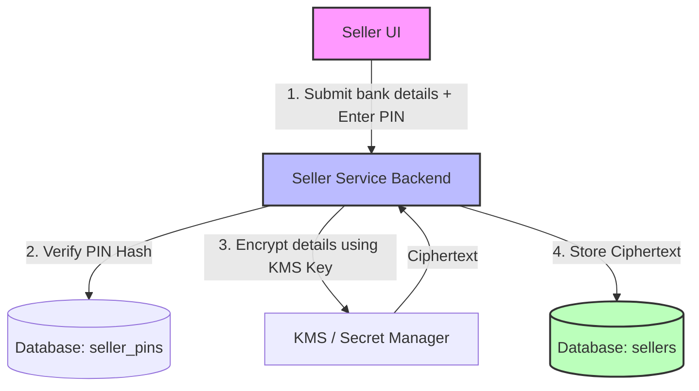

# Security Design: Encrypting Seller Financial Details

This document outlines the security architecture for encrypting and decrypting sensitive seller financial details in WeMall:
1. `bank_name`
2. `bank_account_number`
3. `ecocash_number`

As a senior engineer and security expert, this plan compares the security models of **User PIN-Derived Keys** vs. **Global KMS Keys**, and recommends a **Hybrid Security Architecture** that meets security, compliance (PCI-DSS aligned), and operational requirements.

---

## 1. Architectural Trade-offs: PIN-Derived vs. Global Encryption Key

### Option A: Encryption Using a Seller PIN-Derived Key
In this model, the encryption key is derived directly from a user-created PIN (e.g., using Argon2id or PBKDF2) whenever they write or view their financial details. The server never stores the raw PIN or the derived key.

*   **Security Strength (Zero-Knowledge):** Extremely high. Even if the database, application server, and cloud keys are fully compromised, an attacker cannot decrypt any seller's financial details without knowing that specific seller's PIN.
*   **Operational Limitation (Fatal for Payouts):** Because the server does not store the key or the PIN, **asynchronous/automated background workers cannot decrypt the financial details to process payouts** (e.g., automated midnight bank transfers or EcoCash payouts). The seller must be online and actively entering their PIN to authorize and trigger the decryption in real time.
*   **Key Recovery Problem:** If a seller forgets their PIN, their bank details are cryptographically unrecoverable. They must reset their PIN, which requires purging and re-entering their banking info.
*   **Low Entropy Vulnerability (Offline Brute-Force):** A 4- or 6-digit PIN has very low entropy (10,000 to 1,000,000 combinations). If an attacker dumps the database, they can run an offline brute-force attack on the AES ciphertext and cracked PINs in less than a second per user, rendering the cryptographic isolation ineffective.

### Option B: Encryption Using a Global Application Key / KMS
In this model, the application uses a high-entropy 256-bit key (managed via environment variables, HashiCorp Vault, AWS KMS, or GCP Secret Manager) to encrypt and decrypt the fields transparently.

*   **Security Strength:** Protects against database-only leaks (e.g., SQL injections, database backups left open, replica compromises).
*   **Operational Strength:** Asynchronous payout workers can decrypt bank/EcoCash numbers to execute automated payments without needing the seller to be online.
*   **Usability:** Standard password/PIN resets do not impact data integrity or recoverability.
*   **Risk:** If the application server itself is fully compromised, an attacker can extract the key or query the KMS/Secret Manager to decrypt the entire database.

---

## 2. Recommended Solution: The Hybrid Security Architecture (Option C)

To achieve **maximum security** without breaking the core business requirement of **automated background payouts**, we recommend a **Hybrid Security Architecture**:



### Core Components of the Hybrid Architecture

1.  **Application-Layer Encryption (Envelope Encryption):**
    *   Encrypt `bank_name`, `bank_account_number`, and `ecocash_number` using **AES-256-GCM** with a global high-entropy key managed by a secure Key Management Service (KMS) or Secret Manager.
    *   This ensures the fields are securely encrypted at rest in PostgreSQL (`TEXT` columns storing base64-encoded ciphertexts + IVs).

2.  **Seller PIN for Re-Authentication (Access Control):**
    *   Implement a 6-digit **Seller PIN** (stored securely as a cryptographic hash using **Argon2id** or **bcrypt** in a separate table/column, e.g., `seller_pin_hash`).
    *   The PIN is **not** used to derive the encryption key. It is used as a **second-factor authentication** to authorize viewing or editing of bank details.

3.  **Strict Data Masking by Default:**
    *   Standard seller profile APIs must **never** return the decrypted bank details.
    *   By default, the API returns masked values (e.g., `bank_account_number: "********1234"`, `ecocash_number: "077****789"`).
    *   To view or edit the unmasked details in the dashboard, the seller must make a specific request (e.g., `/api/v1/sellers/bank-details/reveal`) and pass their current PIN. The backend validates the PIN hash, decrypts the database values using the KMS key, and returns the plaintext.

4.  **Asynchronous Payout Processing:**
    *   The background worker processing payouts can read the encrypted details from the database and decrypt them using the KMS key. This allows automated payouts to run seamlessly while keeping the data secure from general access.

5.  **Audit Logging & Security Controls:**
    *   Implement strict audit logging for any read/write access to the unmasked financial details.
    *   Introduce a cooldown period (e.g., 24 hours) after a PIN change or update to bank details during which payouts are locked, mitigating account takeovers.

---

## 3. Database Migration and Schema Updates

To support the Hybrid Architecture, we need to:
1.  Store the hashed Seller PIN.
2.  Store the encryption metadata (such as the Initialization Vector / IV) alongside the ciphertext if not using a packed format.
    > [!TIP]
    > A packed format like `v1:base64(iv):base64(ciphertext)` can be stored directly in the existing `TEXT` columns in PostgreSQL without requiring additional columns for IVs or key versions.

### Proposed DB Schema Additions (Migration)

```sql
-- Migration to add PIN hash and status columns to sellers
ALTER TABLE sellers
ADD COLUMN seller_pin_hash TEXT,
ADD COLUMN bank_details_last_updated TIMESTAMPTZ,
ADD COLUMN payouts_locked_until TIMESTAMPTZ;
```

---

## 4. Cryptographic Implementation Details (Go)

We will implement an encryption utility in the shared package (`pkg/crypto`) or directly within `seller-service/internal/crypto`.

### Encryption Helper Interface
```go
package crypto

import (
	"crypto/aes"
	"crypto/cipher"
	"crypto/rand"
	"encoding/base64"
	"errors"
	"fmt"
	"io"
	"strings"
)

type Encryptor interface {
	Encrypt(plaintext string) (string, error)
	Decrypt(ciphertext string) (string, error)
}

type AESGCMEncryptor struct {
	key []byte // 32 bytes for AES-256
}

func NewAESGCMEncryptor(key []byte) (*AESGCMEncryptor, error) {
	if len(key) != 32 {
		return nil, errors.New("key must be exactly 32 bytes for AES-256")
	}
	return &AESGCMEncryptor{key: key}, nil
}

// Encrypt encrypts plaintext and returns a packed format: "aes256gcm:<iv>:<ciphertext>"
func (e *AESGCMEncryptor) Encrypt(plaintext string) (string, error) {
	block, err := aes.NewCipher(e.key)
	if err != nil {
		return "", err
	}

	aesgcm, err := cipher.NewGCM(block)
	if err != nil {
		return "", err
	}

	iv := make([]byte, aesgcm.NonceSize())
	if _, err := io.ReadFull(rand.Reader, iv); err != nil {
		return "", err
	}

	ciphertext := aesgcm.Seal(nil, iv, []byte(plaintext), nil)
	
	encodedIV := base64.StdEncoding.EncodeToString(iv)
	encodedCiphertext := base64.StdEncoding.EncodeToString(ciphertext)

	return fmt.Sprintf("aes256gcm:%s:%s", encodedIV, encodedCiphertext), nil
}

// Decrypt parses the packed format and decrypts it
func (e *AESGCMEncryptor) Decrypt(ciphertext string) (string, error) {
	parts := strings.Split(ciphertext, ":")
	if len(parts) != 3 || parts[0] != "aes256gcm" {
		return "", errors.New("invalid ciphertext format")
	}

	iv, err := base64.StdEncoding.DecodeString(parts[1])
	if err != nil {
		return "", fmt.Errorf("failed to decode IV: %w", err)
	}

	cipherVal, err := base64.StdEncoding.DecodeString(parts[2])
	if err != nil {
		return "", fmt.Errorf("failed to decode ciphertext: %w", err)
	}

	block, err := aes.NewCipher(e.key)
	if err != nil {
		return "", err
	}

	aesgcm, err := cipher.NewGCM(block)
	if err != nil {
		return "", err
	}

	plaintext, err := aesgcm.Open(nil, iv, cipherVal, nil)
	if err != nil {
		return "", fmt.Errorf("failed to decrypt data (possibly wrong key or tampered payload): %w", err)
	}

	return string(plaintext), nil
}
```

---

## 5. Implementation Roadmap

### Phase 1: Key Provisioning & Config
1.  Generate a high-entropy 32-byte key for AES-256.
2.  In production, inject this key via environment variables (`SELLER_BANK_ENCRYPTION_KEY`) using AWS KMS or HashiCorp Vault.
3.  Load the key into `seller-service` config.

### Phase 2: Crypto Integration in service
1.  Initialize the `Encryptor` when starting the service.
2.  Modify the `UpdateStore` method:
    *   If `BankName`, `BankAccountNumber`, or `EcocashNumber` are provided, encrypt them before saving to the DB.
3.  Modify read queries (`GetSeller`, `GetSellerByUserID`, etc.) to decrypt these fields.
    *   *Note:* Decide if decryption should happen inside the service layer or in a separate presentation layer. For background payout jobs, we need the raw fields, but for public queries or standard APIs we want them masked or decrypted only with permission.

### Phase 3: Seller PIN Management API
1.  Create API endpoints:
    *   `POST /api/v1/sellers/pin/set` (Set PIN, requires email/password credentials).
    *   `POST /api/v1/sellers/pin/verify` (Verify PIN, returns temporary authorized token or marks session).
2.  Update read API:
    *   Default `GET /api/v1/sellers/store` returns masked bank details:
        *   `bank_account_number` -> `*******5678`
        *   `ecocash_number` -> `077****321`
    *   Create `POST /api/v1/sellers/store/reveal-bank-details` which requires the `pin` in request body. On success, it returns plaintext values.

### Phase 4: Integration & Verification
1.  Verify the migration and backfill existing unencrypted bank details (if any exist in dev/staging).
2.  Write unit tests validating that bank details stored in the DB are indeed encrypted (e.g. check direct SQL output) and that the service correctly handles decryption.
