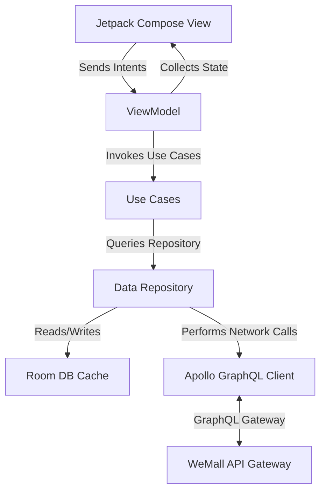

# WeMall Android Client: Enterprise-Grade Frontend Design & Architecture (Taobao Inspired)

This document provides a comprehensive, production-grade frontend design and architecture specification for the WeMall Android client app. The design is inspired by modern Chinese e-commerce giants (specifically **Taobao**), emphasizing high density, visual richness, vibrant colors, fluid animations, and real-time interactions.

---

## 1. Design Philosophy & Visual Design System

The app features an immersive, content-rich design that encourages exploration. It avoids flat, empty spaces in favor of structured grids, swipeable tabs, and interactive card modules.

```
┌──────────────────────────────────────────────────────────┐
│  [🔍 Search for products, stores...]           [💬 Chat] │
├──────────────────────────────────────────────────────────┤
│  ⚡ FLASH SALE  |  🔥 TRENDING  |  📍 NEARBY  |  🎁 COUPONS  │
├──────────────────────────────────────────────────────────┤
│ ┌──────────────────────┐    ┌──────────────────────┐    │
│ │   [Product Image]    │    │   [Product Image]    │    │
│ │                      │    │                      │    │
│ │ Super Phone Pro      │    │ Cozy Couch 3-Seater  │    │
│ │ $999.00              │    │ $450.00              │    │
│ │ 📍 1.2 km away       │    │ 📍 4.5 km away       │    │
│ │ ⭐ 4.9 (120 reviews) │    │ ⭐ 4.7 (40 reviews)  │    │
│ └──────────────────────┘    └──────────────────────┘    │
└──────────────────────────────────────────────────────────┘
```

### 1.1 Color Palette
WeMall uses a warm, energetic, and highly interactive color palette tailored for immediate engagement:

*   **Primary Accent (Taobao Orange)**: `#FF5000` (Main brand color used for primary buttons, highlights, selected states, and price highlights).
*   **Secondary Accent (Alizarin Red)**: `#FF0036` (Used for urgent states like Flash Sales, hot badges, and countdown timers).
*   **Golden Yellow**: `#FFB900` (Used for stars, reviews, and membership features).
*   **Dark Neutral (Slate)**: `#1A1A1A` (Body text, primary titles, and deep dark mode accents).
*   **Light Neutral (Vanilla/Grey)**: `#F4F4F6` (App background, card spacing, and non-selected tabs).
*   **Glassmorphism Backdrop**: `rgba(255, 255, 255, 0.75)` with a `20dp` blur filter for floating app bars and cart sheets.

### 1.2 Typography
Using Google Fonts **Outfit** for headlines/pricing and **Inter** for readability:

*   **Header / Hero**: `Outfit`, Bold, `32sp`
*   **Title / Price**: `Outfit`, SemiBold, `18sp` to `22sp` (Prices are displayed large with currency symbol scaled down).
*   **Body Text**: `Inter`, Regular, `14sp`
*   **Metadata / Badges**: `Inter`, Medium, `11sp` (All caps for labels).

### 1.3 Layout & Card Structure
*   **Dual-Column Masonry Feeds**: Vertical scrolling homepage utilizing a staggered grid layout. Cards feature 16dp rounded corners, subtle drop shadows (`elevation = 2dp`), and a clean background.
*   **Bottom Sheet Modals**: Fully rounded top-corners (`24dp`) with spring physics for checkout, address confirmation, and variation selectors.

---

## 2. Technical Stack & Component Architecture

The app is built as a single-activity application utilizing **Jetpack Compose** and **Kotlin Multiplatform (KMP)** for maximum performance and code sharing.

### 2.1 Technology Stack
*   **UI Framework**: Jetpack Compose (Material 3).
*   **Architecture Pattern**: MVI (Model-View-Intent) using Kotlin Coroutines and StateFlow.
*   **DI Engine**: Hilt / Dagger.
*   **Network Client**: Apollo GraphQL Kotlin (Type-safe query and mutation generation).
*   **Local Storage**: Room Database (Offline-first caching).
*   **Image Loading**: Coil (Compose-optimized, disk-cached).
*   **Notifications**: Firebase Cloud Messaging (FCM) + Android Notification Channels.

### 2.2 Architecture Diagram



### 2.3 State Management Code Blueprint (MVI)

```kotlin
// UI State representing the Product Detail screen
data class ProductUiState(
    val isLoading: Boolean = false,
    val product: Product? = null,
    val selectedVariant: ProductVariant? = null,
    val followStatus: Boolean = false,
    val error: String? = null
)

// Intent representing user interactions
sealed interface ProductIntent {
    data class LoadProduct(val productId: String) : ProductIntent
    data class SelectVariant(val variant: ProductVariant) : ProductIntent
    object ToggleFollowStore : ProductIntent
    data class AddToCart(val quantity: Int) : ProductIntent
}

// ViewModel managing StateFlow
@HiltViewModel
class ProductViewModel @Inject constructor(
    private val getProductUseCase: GetProductUseCase,
    private val followStoreUseCase: FollowStoreUseCase,
    private val addToCartUseCase: AddToCartUseCase
) : ViewModel() {

    private val _uiState = MutableStateFlow(ProductUiState())
    val uiState: StateFlow<ProductUiState> = _uiState.asStateFlow()

    fun handleIntent(intent: ProductIntent) {
        viewModelScope.launch {
            when (intent) {
                is ProductIntent.LoadProduct -> loadProduct(intent.productId)
                is ProductIntent.SelectVariant -> {
                    _uiState.update { it.copy(selectedVariant = intent.variant) }
                }
                is ProductIntent.ToggleFollowStore -> toggleFollowStore()
                is ProductIntent.AddToCart -> addToCart(intent.quantity)
            }
        }
    }

    private suspend fun loadProduct(productId: String) {
        _uiState.update { it.copy(isLoading = true) }
        try {
            val product = getProductUseCase(productId)
            _uiState.update { it.copy(isLoading = false, product = product, selectedVariant = product.variants.firstOrNull()) }
        } catch (e: Exception) {
            _uiState.update { it.copy(isLoading = false, error = e.localizedMessage) }
        }
    }

    private suspend fun toggleFollowStore() {
        val current = _uiState.value
        val sellerId = current.product?.sellerId ?: return
        val success = followStoreUseCase(sellerId, !current.followStatus)
        if (success) {
            _uiState.update { it.copy(followStatus = !current.followStatus) }
        }
    }

    private suspend fun addToCart(quantity: Int) {
        val variantId = _uiState.value.selectedVariant?.id ?: return
        addToCartUseCase(variantId, quantity)
    }
}
```

---

## 3. Micro-Animations & Dynamic Motion

Transitions in WeMall are playful, high-frame-rate, and physics-based, ensuring the app feels responsive.

### 3.1 Scroll-Driven Sticky Search Bar
As the user scrolls down the Home Feed, the search bar seamlessly shifts from an inline card to a sticky transparent toolbar, shrinking the logo and floating above the content.

```kotlin
val scrollState = rememberLazyGridState()
val searchBarAlpha by remember {
    derivedStateOf {
        val firstVisibleIndex = scrollState.firstVisibleItemIndex
        val firstVisibleOffset = scrollState.firstVisibleItemScrollOffset
        if (firstVisibleIndex > 0) 1f
        else (firstVisibleOffset / 300f).coerceIn(0f, 1f)
    }
}
```

### 3.2 Product Detail Parallax Header
The product image carousel uses a parallax translation factor based on vertical scrolling offset, combined with a scale zoom when pulled down beyond the top bounds (rubber-banding).

```kotlin
val scrollState = rememberScrollState()
val imageOffset = (scrollState.value * 0.4f).dp
val scale = if (scrollState.value < 0) {
    1f + (-scrollState.value / 600f)
} else 1f
```

### 3.3 Flying Cart Animation
When a user taps "Add to Cart", a small thumbnail replica of the product image is spawned at the tap coordinates and dynamically travels on a parabolic Bezier path down into the bottom navigation bar's Cart icon. On arrival, the Cart icon performs a bouncy scale pop (`scale = 1.3 -> 1.0`).

```kotlin
// Target bounce animation using spring physics
val scaleValue = remember { Animatable(1f) }
LaunchedEffect(cartItemCount) {
    scaleValue.animateTo(
        targetValue = 1.3f,
        animationSpec = spring(dampingRatio = Spring.DampingRatioHighBouncy)
    )
    scaleValue.animateTo(1.0f)
}
```

---

## 4. End-to-End User Journeys

### 4.1 Onboarding & Phone OTP Verification
1. **Interactive Entry**: Clean screen displaying animated merchant/buyer banners (using Lottie).
2. **OTP Generation**: User enters phone number (e.g. `+263773333333`). Client fires `buyerSendOTP` mutation.
3. **Auto-OTP SMS Listener**: App registers a temporary `SMSBroadcastReceiver` to read SMS messages matching the format `Your WeMall code: (\d{6})`.
4. **Verification**: Upon receipt, code is automatically populated, and `buyerVerifyOTP` mutation is invoked. The JWT token is saved securely in the Android keystore (`EncryptedSharedPreferences`).

```
┌──────────────────────────────────────┐
│          WeMall Onboarding           │
├──────────────────────────────────────┤
│  Enter Phone:                        │
│  [ +263 773 333 333 ]                │
│                                      │
│  [     REQUEST VERIFICATION CODE   ] │
│                                      │
│  ─── OR ───                          │
│                                      │
│  [ G  Continue with Google         ] │
└──────────────────────────────────────┘
```

### 4.2 Home / Discovery Feed (Personalized & Geo-Located)
1. **Unified Search & Categories**: Home layout starts with an animated sliding category selector loaded via the `categories` query.
2. **Distance & Map Integration**: Using `nearbyProducts` query, the app fetches the user's GPS coordinates and displays the distance in kilometers (`distance` field in GraphQL).
3. **Dual Feeds**: Displays a tab layout switching between "For You" (personalized recommendations via `personalizedRecommendations` query) and "Nearby Shops".
4. **Masonry Loading**: Utilizes infinite scroll with pagination tokens (`nextPageToken`).

### 4.3 Variation Selector & Store Follow
1. **Store Header**: Product page queries the seller details (`dsr` averages, verification status, and follower count).
2. **Interactive Store Follow**: Follow button toggles instantly on the UI, triggering the `followStore` or `unfollowStore` mutations in the background.
3. **Dynamic Variant Grid**: When tapping "Buy Now" or "Add to Cart", a Material 3 sheet slides up. The user selects options (color, storage size, variant). The variant's stock level and price are dynamically evaluated.

```
┌──────────────────────────────────────┐
│ [Variant Thumbnail]   Super Phone    │
│                       $999.00        │
│                       Stock: 45      │
├──────────────────────────────────────┤
│  Color:                              │
│  ( ) Just Black   (●) Chalk White    │
│                                      │
│  Storage:                            │
│  ( ) 128GB        (●) 256GB          │
├──────────────────────────────────────┤
│  Quantity:                           │
│  [ - ]   1   [ + ]                   │
├──────────────────────────────────────┤
│  [          CONFIRM CHOICE         ] │
└──────────────────────────────────────┘
```

### 4.4 Cart Lifecycle & Multi-Currency Checkout
1. **Dynamic Cart Actions**: Items displayed grouped by Seller Store. Users can toggle items to include in the checkout, edit quantities (triggering `updateCartItem`), or swipe left to remove (`removeCartItem`).
2. **Checkout Page**: Calculates the total dynamically. Features a toggle to switch currency display between USD and ZWG using the live exchange rate (`ZWG_USD_RATE` retrieved from the backend API).
3. **Coupon Selector**: Users can browse active seller promotions and apply coupons using the `applyCoupon` mutation.

### 4.5 Google Pay & Stripe Payment Integrations
1. **Payment Initiation**: When clicking "Proceed to Payment", client calls `initiatePayment(orderId: $orderId, provider: GOOGLE_PAY)` to obtain the payment ID and the `clientSecret` (`merchant:BCR2DN5T5733RWQV:payment:<paymentId>`).
2. **Google Pay Sheet**:
   - The app configures the Google Pay API client:
     ```json
     {
       "apiVersion": 2,
       "apiVersionMinor": 0,
       "allowedPaymentMethods": [
         {
           "type": "CARD",
           "parameters": {
             "allowedAuthMethods": ["PAN_ONLY", "CRYPTOGRAM_3D_SECURE"],
             "allowedCardNetworks": ["VISA", "MASTERCARD"]
           },
           "tokenizationSpecification": {
             "type": "PAYMENT_GATEWAY",
             "parameters": {
               "gateway": "example",
               "gatewayMerchantId": "BCR2DN5T5733RWQV"
             }
           }
         }
       ]
     }
     ```
   - Client displays the native Google Pay sheet. On success, Google returns a payment token.
3. **Payment Completion**:
   - Client calls `processPayment(paymentId: $paymentId, token: $token)`.
   - On completion, the gateway updates the status to `completed` and NATS automatically notifies the `order-service` which transitions the order status from `PENDING` to `CONFIRMED`.
   - The app displays a beautiful animated checkmark, redirecting the user to their order details page.

### 4.6 Real-Time Live Chat & Dispute Resolution
1. **WebSocket Message Pipeline**: Live chat with sellers is established using GraphQL subscriptions (`chatMessages`) or polled via WebSocket.
2. **Dispute Resolution Flow**: If an order has issues, the buyer can click "Open Dispute", choose a reason, attach evidence images, and invoke `openDispute(orderId: $orderId, reason: $reason, evidenceUrls: $evidenceUrls)`.
3. **Admin Resolve Notification**: Real-time push updates let the buyer know when the admin resolves the dispute or processes a refund.

### 4.7 Push Notifications & FCM Integration
1. **Device Registration**: Upon login, the client registers the FCM token using the `registerDeviceToken` mutation.
2. **Notification Channels**: Sets up critical channels on Android 8.0+:
   *   `TRANSACTIONAL`: High importance (e.g. "Order Shipped", "Payment Success", with custom ringtones).
   *   `CHAT`: High importance, heads-up notification for messages.
   *   `MARKETING`: Low importance, silent badges.
3. **Deep Linking**: Payload structures allow the app to automatically route the user to specific screens when notifications are tapped:
   - `wemall://order/{orderId}` -> Routes to Order Details.
   - `wemall://chat/{threadId}` -> Routes to Seller Chat Thread.
   - `wemall://dispute/{disputeId}` -> Routes to Dispute Details.
