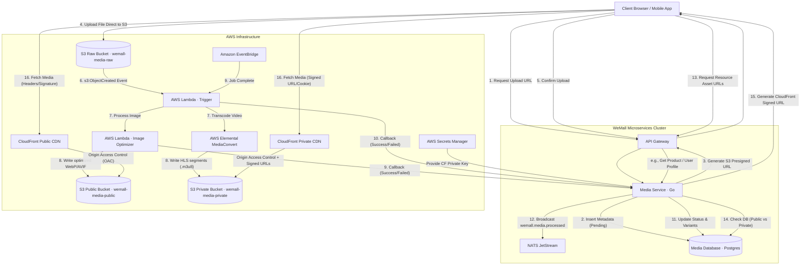

# WeMall — AWS Media Service Architecture & Implementation Plan

This document outlines a high-throughput, highly secure, and cost-effective enterprise-level media storage, processing, and distribution architecture for **WeMall**. 

To avoid performance bottlenecks on core microservices, this architecture leverages **Amazon S3 Direct Uploads via Presigned URLs**, **Amazon CloudFront CDN (with Origin Access Control)**, and an event-driven processing pipeline using **AWS Lambda** and **AWS Elemental MediaConvert**. An independent **Media Service** acting as the control plane governs uploads, validation, metadata, and signed URL generation.

---

## 1. Architectural Topology

The following diagram illustrates the complete end-to-end flow from client upload, processing, storage, to secure global content delivery.



---

## 2. Media Upload Pipeline (Direct-to-S3)

To scale media uploads to millions of items without crashing our application servers or paying massive bandwidth overhead:

1. **Decoupled Uploads**: Application servers do not receive file bytes. Clients request permission to upload, receive a presigned URL, and stream files directly to Amazon S3.
2. **Metadata Cataloging**: The `media-service` keeps track of upload states (`pending`, `processing`, `completed`, `failed`) and enforces business rules (maximum sizes, permitted MIME types) before generating the presigned upload URL.

### S3 Multi-Bucket Strategy

- **Raw Bucket (`wemall-media-raw`)**:
  - Entirely private, not accessible via CDN.
  - Temporary landing zone for raw client uploads.
  - Lifecycle Policy: **Delete objects after 24 hours** to prevent orphans or abandoned uploads from consuming storage costs indefinitely.
- **Processed Public Bucket (`wemall-media-public`)**:
  - Storage for optimized media visible to all users (product images, seller shop banners, categories).
  - Accessible ONLY by CloudFront via **Origin Access Control (OAC)**. No public S3 read policies allowed.
- **Processed Private Bucket (`wemall-media-private`)**:
  - Storage for authenticated/restricted media (seller KYC documents, tax forms, private invoices, paid content, digital goods).
  - Accessible ONLY by CloudFront via OAC **and requiring signed URLs or signed cookies**.

---

## 3. Event-Driven Media Processing Pipeline

When a file successfully lands in the S3 Raw bucket, an event-driven workflow automatically starts.

### A. S3 Event Notifications
The S3 Raw bucket publishes `s3:ObjectCreated:*` notifications to an AWS Lambda router function.

### B. Image Optimization & Resizing (Lambda)
The Lambda function retrieves the raw image and performs the following operations using standard high-performance libraries like `libvips` (e.g., using the `sharp` package in Node.js or `bimg` in Go):
1. **EXIF Stripping**: Strips GPS coordinates, camera models, and creation timestamps for user privacy.
2. **Auto-Rotation**: Inspects the orientation metadata tag and applies correct visual rotation before stripping.
3. **Multi-format Encoding**: Converts the image into next-gen formats to minimize byte weight:
   - **AVIF**: Core target format. Offers up to 50% better compression than JPEG and 20-30% better than WebP at equivalent visual quality.
   - **WebP**: Fallback format offering 25-34% better compression than JPEG, supported by virtually all modern browsers.
4. **Targeted Variant Generation**: To optimize data consumption dynamically on the client, Lambda generates the following responsive variants:
   - **`thumbnail_small`**: `100x100px` square cropped. Used for avatar previews and listing icons. (~4 KB in AVIF).
   - **`thumbnail_large`**: `250x250px` square cropped. Used for product grids, search pages, and shopping carts. (~12 KB in AVIF).
   - **`main_mobile`**: Max width `480px` (aspect ratio preserved). Optimized for small screens on standard mobile connections. (~35 KB in AVIF).
   - **`main_tablet`**: Max width `800px` (aspect ratio preserved). Optimized for tablets and medium viewports. (~75 KB in AVIF).
   - **`main_desktop`**: Max width `1200px` (aspect ratio preserved). Optimized for large high-resolution desktop viewports. (~120 KB in AVIF).
   - **`main_large_retina`**: Max width `2000px` (aspect ratio preserved). Used for product image zoom controls and high-pixel-density Retina displays. (~220 KB in AVIF).
5. **Output Storage**: Writes these variants in both AVIF and WebP formats to the processed public bucket: `images/${media_id}/${variant_name}.${ext}` (e.g. `images/a1b2-c3d4/thumbnail_large.avif` and `images/a1b2-c3d4/thumbnail_large.webp`).

### C. Video Transcoding (AWS Elemental MediaConvert)
Videos require dynamic bitrates and chunking for fast buffering and device compatibility.
1. The router Lambda creates an AWS Elemental MediaConvert job.
2. **Adaptive Bitrate (ABR)**: MediaConvert transcodes the video file into **HLS (HTTP Live Streaming)** streams with multi-bitrate outputs (1080p, 720p, 480p).
3. **Segmenting**: The video is broken down into small `.ts` file segments alongside a master `.m3u8` manifest file.
4. **Output Storage**: Writes the manifest and segment files to the target public or private bucket: `videos/${media_id}/playlist.m3u8`.
5. **Completion Hook**: Amazon EventBridge captures the MediaConvert job success state, triggering a final Lambda to notify the `media-service` via gRPC or Webhook.

---

## 4. Responsive Image & Data Optimization Strategy

Raw uploads from sellers or users are often captured directly via phone cameras, resulting in file sizes between `2 MB` and `10 MB`. Serving these files directly will result in poor page speed, high data consumption fees, and lower search engine rankings (due to Core Web Vitals penalties).

### Comparison of User Data Consumption

By converting to next-gen formats and forcing viewport-matching dimensions, WeMall reduces data transfer sizes by up to **99.9%**:

| Asset Variant | Target Resolution | Avg. AVIF Size | Avg. WebP Size | Avg. Raw Upload | Data Savings % |
| :--- | :--- | :--- | :--- | :--- | :--- |
| `thumbnail_small` | `100x100px` (Square) | **3 - 5 KB** | 6 - 8 KB | 4.5 MB | **99.9%** |
| `thumbnail_large` | `250x250px` (Square) | **10 - 15 KB** | 15 - 20 KB | 4.5 MB | **99.7%** |
| `main_mobile` | `480px` Width (Preserved) | **30 - 45 KB** | 45 - 60 KB | 4.5 MB | **99.1%** |
| `main_tablet` | `800px` Width (Preserved) | **65 - 85 KB** | 90 - 110 KB | 4.5 MB | **98.3%** |
| `main_desktop` | `1200px` Width (Preserved) | **100 - 130 KB** | 140 - 180 KB | 4.5 MB | **97.3%** |
| `main_large_retina` | `2000px` Width (Preserved) | **190 - 240 KB** | 280 - 350 KB | 4.5 MB | **95.1%** |

### Client-Side Integration Patterns (HTML5 & React)

Frontend clients should consume these endpoints using native responsive image features. This allows browsers to automatically decide which image size to download before fetching the bytes, aligning perfectly with modern UX standards.

#### React Responsive Image Component Example

```jsx
import React from 'react';

export const ResponsiveProductImage = ({ mediaId, altText, className }) => {
  const cdnBase = "https://cdn.wemall.com/images/" + mediaId;

  return (
    <picture className={className}>
      {/* 1. Prefer AVIF variants for modern viewports */}
      <source 
        media="(max-width: 480px)" 
        srcSet={`${cdnBase}/main_mobile.avif`} 
        type="image/avif" 
      />
      <source 
        media="(max-width: 800px)" 
        srcSet={`${cdnBase}/main_tablet.avif`} 
        type="image/avif" 
      />
      <source 
        media="(min-width: 801px)" 
        srcSet={`${cdnBase}/main_desktop.avif`} 
        type="image/avif" 
      />

      {/* 2. Fallback to WebP variants for high-compatibility */}
      <source 
        media="(max-width: 480px)" 
        srcSet={`${cdnBase}/main_mobile.webp`} 
        type="image/webp" 
      />
      <source 
        media="(max-width: 800px)" 
        srcSet={`${cdnBase}/main_tablet.webp`} 
        type="image/webp" 
      />
      <source 
        media="(min-width: 801px)" 
        srcSet={`${cdnBase}/main_desktop.webp`} 
        type="image/webp" 
      />

      {/* 3. Standard default image fallback with lazy loading */}
      
    </picture>
  );
};
```

> [!TIP]
> Always define `loading="lazy"` on all offscreen images. Combining dynamic resizing with lazy loading ensures that a buyer scrolling through a long category list of 100 products only downloads the specific thumbnails currently inside their viewport, slashing their mobile data consumption by hundreds of megabytes.

---

## 5. Content Delivery Network (CDN) & Secure Distribution

To serve files globally with sub-100ms latency, Amazon CloudFront sits in front of S3.

```
┌──────────┐         ┌────────────────────┐         ┌──────────────┐
│  Client  ├────────>│ Amazon CloudFront  ├────────>│  S3 Bucket   │
└──────────┘         │  (CDN / Caching)   │         │ (Processed)  │
                     └─────────┬──────────┘         └──────────────┘
                               │
                       OAC Policy Checks
```

### A. Origin Access Control (OAC)
WeMall enforces **Origin Access Control (OAC)** to secure the S3 origins.
- S3 buckets are configured to block all public access.
- S3 Bucket Policies explicitly allow the CloudFront Service Principal to read files:

```json
{
    "Version": "2012-10-17",
    "Statement": [
        {
            "Sid": "AllowCloudFrontServicePrincipalReadOnly",
            "Effect": "Allow",
            "Principal": {
                "Service": "cloudfront.amazonaws.com"
            },
            "Action": "s3:GetObject",
            "Resource": "arn:aws:s3:::wemall-media-public/*",
            "Condition": {
                "StringEquals": {
                    "AWS:SourceArn": "arn:aws:cloudfront::123456789012:distribution/ED1234567890"
                }
            }
        }
    ]
}
```

### B. Accessing Private Media via Signed URLs & Cookies
For private media (KYC docs, invoices, or premium files stored in `wemall-media-private`):
1. **CloudFront Key Groups**: A private/public keypair is generated. The Public Key is registered in AWS CloudFront and added to a "Key Group".
2. **Trusted Signers**: The CloudFront behavior for `wemall-media-private` is configured to restrict viewer access and trust the newly created Key Group.
3. **Signed URLs**: The `media-service` loads the corresponding Private Key from AWS Secrets Manager (caching it locally to reduce KMS calls). When an authorized user requests a private file, the `media-service` dynamically signs the CloudFront resource path using the private key, specifying:
   - **Expiration Epoch Time**: Set to standard short lifespans (e.g., +15 minutes).
   - **IP Range Restriction (Optional)**: Locks the URL to the client's IPv4/IPv6 address.
4. **Signed Cookies**: For resources loading multiple files consecutively (e.g., HLS video streams containing multiple segments), standard URLs would fail on segment requests. In this case, `media-service` returns three `Set-Cookie` headers (`CloudFront-Policy`, `CloudFront-Signature`, `CloudFront-Key-Pair-Id`). All subsequent browser requests for video chunks pass these cookies, allowing seamless playback of secured video.

---

## 5. Independent Media Service Design

The `media-service` acts as the control plane for WeMall's media management. It is designed to be an independent Go service.

### A. Database Schema (`wemall_media`)

```sql
-- Create Enum for Media Statuses
CREATE TYPE media_status AS ENUM (
    'pending_upload',  -- Presigned S3 URL generated, waiting for client upload
    'uploaded',        -- Client confirmed S3 upload, ready for processing
    'processing',      -- Lambda or MediaConvert is converting resources
    'completed',       -- Asset variants successfully written to destination S3
    'failed'           -- Error occurred during validation, transcoding, or storage
);

-- Media Metadata Tracking Table
CREATE TABLE media_assets (
    id             UUID             PRIMARY KEY DEFAULT gen_random_uuid(),
    owner_id       UUID             NOT NULL,               -- User/Seller ID who uploaded
    service_scope  VARCHAR(50)      NOT NULL,               -- 'user-avatar' | 'product-image' | 'seller-kyc'
    original_name  VARCHAR(255)     NOT NULL,               -- e.g. "profile_pic.jpg"
    mime_type      VARCHAR(100)     NOT NULL,               -- e.g. "image/jpeg"
    size_bytes     BIGINT           NOT NULL,               -- Size of raw upload in bytes
    raw_s3_key     VARCHAR(512)     NOT NULL,               -- Key in wemall-media-raw
    is_private     BOOLEAN          NOT NULL DEFAULT FALSE, -- Determines S3 destination & CF signed access
    status         media_status     NOT NULL DEFAULT 'pending_upload',
    variants       JSONB,                                   -- Stores URL maps of optimized outputs
    error_message  TEXT,                                    -- Populated if status is 'failed'
    created_at     TIMESTAMPTZ      NOT NULL DEFAULT NOW(),
    updated_at     TIMESTAMPTZ      NOT NULL DEFAULT NOW()
);

-- Indexes for performance
CREATE INDEX idx_media_assets_owner ON media_assets(owner_id);
CREATE INDEX idx_media_assets_status ON media_assets(status) WHERE status != 'completed';
```

### B. Protobuf Definition (`proto/media/v1/media.proto`)

```protobuf
syntax = "proto3";

package wemall.media.v1;

option go_package = "github.com/wemall/gen/media/v1;mediav1";

import "google/protobuf/timestamp.proto";

service MediaService {
    // Generate a secure presigned S3 upload URL for large client-side uploads
    rpc RequestUploadUrl(RequestUploadUrlRequest) returns (RequestUploadUrlResponse);

    // Confirm that the upload to S3 raw bucket completed and queue it for processing
    rpc ConfirmUpload(ConfirmUploadRequest) returns (ConfirmUploadResponse);

    // Retrieve details for a single media asset and all its variants (with signed URLs if private)
    rpc GetMediaAsset(GetMediaAssetRequest) returns (GetMediaAssetResponse);

    // Batch fetch details for a list of media assets
    rpc BatchGetMediaAssets(BatchGetMediaAssetsRequest) returns (BatchGetMediaAssetsResponse);

    // Paginated list of media assets uploaded by a user or seller with status filters
    rpc ListMediaAssets(ListMediaAssetsRequest) returns (ListMediaAssetsResponse);
}

message RequestUploadUrlRequest {
    string owner_id = 1;
    string service_scope = 2; // e.g., "product-image", "user-avatar", "seller-kyc"
    string filename = 3;      // e.g., "headset.png"
    string mime_type = 4;     // e.g., "image/png"
    int64 size_bytes = 5;
}

message RequestUploadUrlResponse {
    string media_id = 1;
    string upload_url = 2; // Presigned S3 PUT URL
    map<string, string> required_headers = 3;
}

message ConfirmUploadRequest {
    string media_id = 1;
}

message ConfirmUploadResponse {
    string media_id = 1;
    string status = 2;
}

message GetMediaAssetRequest {
    string media_id = 1;
    string requested_by_user_id = 2;
}

// Structured image variants showing both formats and all responsive sizes
message ImageVariants {
    string thumbnail_small_avif = 1;
    string thumbnail_small_webp = 2;
    string thumbnail_large_avif = 3;
    string thumbnail_large_webp = 4;
    string main_mobile_avif = 5;
    string main_mobile_webp = 6;
    string main_tablet_avif = 7;
    string main_tablet_webp = 8;
    string main_desktop_avif = 9;
    string main_desktop_webp = 10;
    string main_large_retina_avif = 11;
    string main_large_retina_webp = 12;
}

// Structured video variants representing HLS, DASH, and raw storage fallbacks
message VideoVariants {
    string hls_playlist_url = 1; // playlist.m3u8 path (CloudFront CDN)
    string dash_playlist_url = 2; // playlist.mpd path (CloudFront CDN)
    repeated string progressive_mp4_urls = 3; // Fallbacks for devices not supporting adaptive streaming
}

// Fallback variants for document attachments (e.g. PDF viewer optimization)
message DocumentVariants {
    string original_url = 1;
    string web_optimized_pdf_url = 2; // Compressed preview PDF
    string preview_thumbnail_url = 3; // Rendered first page thumbnail image
}

message MediaVariants {
    oneof type_variants {
        ImageVariants image = 1;
        VideoVariants video = 2;
        DocumentVariants document = 3;
    }
}

message MediaAsset {
    string id = 1;
    string owner_id = 2;
    string original_name = 3;
    string mime_type = 4;
    string status = 5; // e.g. "pending_upload", "processing", "completed", "failed"
    bool is_private = 6;
    MediaVariants variants = 7; // The dynamic nested variants containing actual URLs
    google.protobuf.Timestamp created_at = 8;
}

message GetMediaAssetResponse {
    MediaAsset asset = 1;
}

message BatchGetMediaAssetsRequest {
    repeated string media_ids = 1;
    string requested_by_user_id = 2;
}

message BatchGetMediaAssetsResponse {
    repeated MediaAsset assets = 1;
}

message ListMediaAssetsRequest {
    string owner_id = 1;
    string service_scope = 2; // e.g. "product-image"
    string mime_type = 3;     // e.g. "image/" (prefix filter)
    string status = 4;        // e.g. "completed"
    int32 limit = 5;
    int32 offset = 6;
}

message ListMediaAssetsResponse {
    repeated MediaAsset assets = 1;
    int32 total_count = 2;
    int32 limit = 3;
    int32 offset = 4;
}
```

### C. HTTP REST Gateway Endpoints

For public frontend clients and third-party integrations, WeMall's **API Gateway** exposes a secure REST API that routes directly to the Go `media-service`.

#### 1. Upload Multimedia File (Multipart HTTP)
- **Endpoint**: `POST /api/v1/media/upload`
- **Headers**: 
  - `Authorization: Bearer <JWT_TOKEN>`
  - `Content-Type: multipart/form-data`
- **Request Parameters**:
  - `file`: The binary payload of the image, video, or document (e.g. `headset.png`).
  - `scope`: The destination scope (e.g., `product-image`, `user-avatar`, `seller-kyc`).
  - `is_private`: Boolean string (e.g. `"true"` or `"false"`) determining whether to restrict access.
- **Processing Logic**: 
  - The Gateway parses the user session. 
  - The `media-service` performs immediate file size and MIME-type validation.
  - Rather than making the client use a presigned URL (useful for large files), this direct upload endpoint receives the bytes, streams them to the S3 Raw bucket, and registers the asset in the database.
  - Returns HTTP `201 Created` immediately with the full `MediaAsset` payload including its initial `status: "processing"`.

##### Example JSON Response:
```json
{
  "id": "c71fa793-1386-4554-b52b-b9d9c228807d",
  "owner_id": "8c25345a-c5c9-4b62-97b7-6bbce3725458",
  "original_name": "headset.png",
  "mime_type": "image/png",
  "status": "processing",
  "is_private": false,
  "variants": null,
  "created_at": "2026-06-04T18:59:21Z"
}
```

#### 2. List Uploaded Media Assets (Paginated)
- **Endpoint**: `GET /api/v1/media`
- **Headers**:
  - `Authorization: Bearer <JWT_TOKEN>`
- **Query Parameters**:
  - `limit`: Integer (default: `20`, max: `100`)
  - `offset`: Integer (default: `0`)
  - `scope`: String filter (e.g., `product-image`)
  - `status`: String filter (e.g., `completed`)
  - `mime_type`: String prefix (e.g., `image/` or `video/`)
- **Processing Logic**:
  - Fetches the collection of assets owned by the calling user.
  - For each completed asset, returns the URLs for **all processed variations** (AVIF and WebP sizes for images; HLS manifests for video).
  - Automatically appends CloudFront signatures for private assets.

##### Example JSON Response:
```json
{
  "assets": [
    {
      "id": "c71fa793-1386-4554-b52b-b9d9c228807d",
      "owner_id": "8c25345a-c5c9-4b62-97b7-6bbce3725458",
      "original_name": "headset.png",
      "mime_type": "image/png",
      "status": "completed",
      "is_private": false,
      "variants": {
        "image": {
          "thumbnail_small_avif": "https://cdn.wemall.com/images/c71fa793-1386-4554-b52b-b9d9c228807d/thumbnail_small.avif",
          "thumbnail_small_webp": "https://cdn.wemall.com/images/c71fa793-1386-4554-b52b-b9d9c228807d/thumbnail_small.webp",
          "thumbnail_large_avif": "https://cdn.wemall.com/images/c71fa793-1386-4554-b52b-b9d9c228807d/thumbnail_large.avif",
          "thumbnail_large_webp": "https://cdn.wemall.com/images/c71fa793-1386-4554-b52b-b9d9c228807d/thumbnail_large.webp",
          "main_mobile_avif": "https://cdn.wemall.com/images/c71fa793-1386-4554-b52b-b9d9c228807d/main_mobile.avif",
          "main_mobile_webp": "https://cdn.wemall.com/images/c71fa793-1386-4554-b52b-b9d9c228807d/main_mobile.webp",
          "main_tablet_avif": "https://cdn.wemall.com/images/c71fa793-1386-4554-b52b-b9d9c228807d/main_tablet.avif",
          "main_tablet_webp": "https://cdn.wemall.com/images/c71fa793-1386-4554-b52b-b9d9c228807d/main_tablet.webp",
          "main_desktop_avif": "https://cdn.wemall.com/images/c71fa793-1386-4554-b52b-b9d9c228807d/main_desktop.avif",
          "main_desktop_webp": "https://cdn.wemall.com/images/c71fa793-1386-4554-b52b-b9d9c228807d/main_desktop.webp",
          "main_large_retina_avif": "https://cdn.wemall.com/images/c71fa793-1386-4554-b52b-b9d9c228807d/main_large_retina.avif",
          "main_large_retina_webp": "https://cdn.wemall.com/images/c71fa793-1386-4554-b52b-b9d9c228807d/main_large_retina.webp"
        }
      },
      "created_at": "2026-06-04T18:59:21Z"
    }
  ],
  "total_count": 1,
  "limit": 20,
  "offset": 0
}
```

---

## 6. Detailed Flow Sequence Diagrams

### A. Complete Client Upload Flow

This sequence visualizes the interaction between the client, API gateway, independent Go `media-service`, S3, and AWS processing.

```
 Client             API Gateway        Media Service           Amazon S3           AWS Processing
   │                     │                   │                     │                     │
   ├─ 1. Request Upload ─>                   │                     │                     │
   │    URL & Metadata   ├─ 2. Forward Request─>                   │                     │
   │                     │                   │                     │                     │
   │                     │                   ├─ 3. Validate size,  │                     │
   │                     │                   │     create db row   │                     │
   │                     │                   │     state PENDING   │                     │
   │                     │                   │                     │                     │
   │                     │                   ├─ 4. Generate S3 ────>                     │
   │                     │                   │     presigned URL   │                     │
   │                     │                   │                     │                     │
   │                     │<─ 5. Return URL ──┤                     │                     │
   │                     │      & Media ID   │                     │                     │
   │<─ 6. Return payload ┤                   │                     │                     │
   │                     │                   │                     │                     │
   │                     │                   │                     │                     │
   │─────────────────── 7. PUT media file raw bytes ──────────────>│                     │
   │                     │                   │                     │                     │
   ├─ 8. Confirm Upload ─>                   │                     │                     │
   │    (Media ID)       ├─ 9. Confirm Upload─>                    │                     │
   │                     │                   │                     │                     │
   │                     │                   ├─ 10. Check raw S3 ──>                     │
   │                     │                   │      object size    │                     │
   │                     │                   │                     │                     │
   │                     │                   ├─ 11. DB state ──────│                     │
   │                     │                   │      'uploaded'     │                     │
   │                     │                   │                     │                     │
   │                     │                   ├─ 12. Trigger NATS ──│                     │
   │                     │                   │      upload event   │                     │
   │                     │                   │                     │                     │
   │                     │<─ 13. ACK Success─┤                     │                     │
   │<─ 14. ACK Success ──┤                   │                     │                     │
   │                     │                   │                     │                     │
   │                     │                   │                     │                     │
   │                     │                   │                     │<── 15. Trigger ─────┤
   │                     │                   │                     │    Lambda processing│
```

---

## 7. Configuration Details & Policies

### AWS S3 CORS Configuration
To allow client browsers to perform multipart uploads directly to the S3 bucket:

```json
[
  {
    "AllowedHeaders": ["*"],
    "AllowedMethods": ["PUT", "POST"],
    "AllowedOrigins": ["https://wemall.com", "https://*.wemall.com"],
    "ExposeHeaders": ["ETag"],
    "MaxAgeSeconds": 3000
  }
]
```

### Server Cache Control Headers (Set by Processing Pipeline)
When Lambda or MediaConvert writes processed files to `wemall-media-public`:
- **Static Assets (Images)**: Set header `Cache-Control: public, max-age=31536000, immutable`.
- **Adaptive Video Playlists (`.m3u8`)**: Set header `Cache-Control: public, max-age=2, must-revalidate` (to allow playlists to update dynamic stream additions during recording sessions).
- **Video Segments (`.ts`)**: Set header `Cache-Control: public, max-age=31536000, immutable`.

---

## 8. Step-by-Step Implementation Roadmap

Implementing this architecture for WeMall should be divided into four phases:

### Phase 1: Infrastructure Deployment (Terraform/CloudFormation)
1. Provision S3 buckets (`raw`, `public`, `private`) with encryption keys and lifecycle rules enabled.
2. Create Amazon CloudFront distributions for public and private behaviors. Configure Origin Access Control (OAC).
3. Set up CloudFront key pair configuration and upload the public signing key.
4. Deploy the AWS Secrets Manager container for storing the private signing key.

### Phase 2: Media Service Core (Go Microservice)
1. Write the database migrations matching the `wemall_media` Postgres schema.
2. Compile and test the `media.proto` definition. Run code generators (`protoc-gen-go` and `protoc-gen-go-grpc`).
3. Implement the Go handler logic:
   - AWS SDK integration for generating `S3 PUT Presigned URLs`.
   - Local validation of payload properties (size checks, MIME types).
   - Integration with WeMall's JWT verification middleware.

### Phase 3: Event-Driven Processing Engine (Lambda & MediaConvert)
1. Deploy AWS Lambda functions using Node.js or Go wrapper around `sharp`/`libvips`.
2. Configure S3 Event Notification rules to trigger Lambda on `ObjectCreated` under the `/raw/` folder.
3. Configure AWS Elemental MediaConvert basic job templates for adaptive HLS streaming.
4. Write the webhook callback in the `media-service` to receive Lambda status notification and update variant maps.

### Phase 4: CDN Integration & Signed Serving Logic
1. Implement the CloudFront URL and cookie signing logic in Go using the official `aws/aws-sdk-go-v2/feature/cloudfront/sign` package.
2. Integrate the `media-service` with existing services (e.g. `product-service` calling media service via gRPC to fetch dynamic product thumbnails, and `user-service` to resolve user avatar locations).
3. Test edge validation behavior: Verify that S3 is unreadable without CloudFront, and that private CloudFront distributions reject requests missing active signatures or expired policies.
