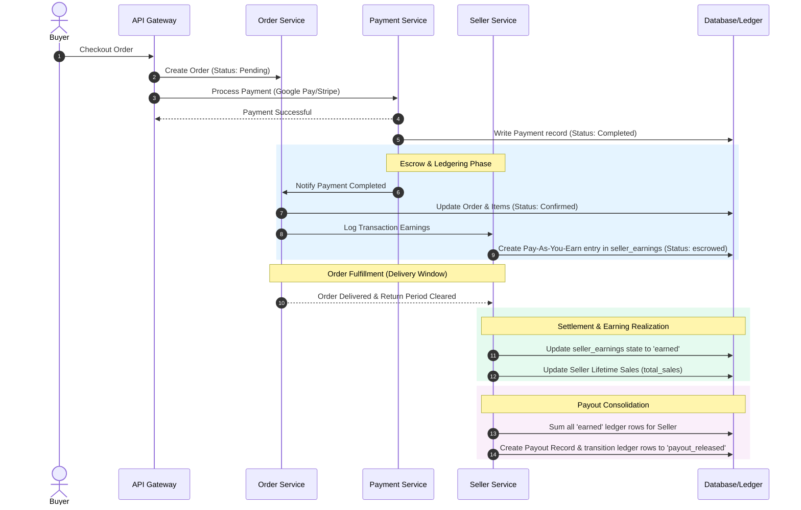

# WeMall Monetization Strategy & Architecture Plan

This document outlines the architectural plan for implementing monetization strategies on the WeMall platform, based on four pillars:
1. **Commission / Take-Rate Fees (Transaction Fees)**
2. **Sponsored Products & Ad Network (Promoted Listings)**
3. **Payout Escrow & Float Management**
4. **Delivery & Fulfillment Margins**

---

## 1. Monetization Flow Architecture

The diagram below illustrates the end-to-end payment, escrow hold, "pay-as-you-earn" commission ledgering, and payout release lifecycle.



---

## 2. Database Schema Extensions

To support monetization and the **Pay-As-You-Earn (PAYE)** commission tracking model, we will introduce a transactional ledger table in the `seller-service` database.

### A. `seller-service` Database
We will create a transactional ledger table `seller_earnings` and update existing tables.

#### 1. Modifications to `sellers` Table
* `commission_rate`: `NUMERIC(4,2) DEFAULT 0.05` — The baseline commission rate for the store (defaults to 5%).
* `ad_credit_balance`: `NUMERIC(12,2) DEFAULT 0.00` — Prepaid balance for running sponsored ads.

```sql
-- Migration: Add monetization fields to sellers
ALTER TABLE sellers 
ADD COLUMN commission_rate NUMERIC(4,2) NOT NULL DEFAULT 0.05,
ADD COLUMN ad_credit_balance NUMERIC(12,2) NOT NULL DEFAULT 0.00;
```

#### 2. [NEW] `seller_earnings` Table (The PAYE Commission Ledger)
This table stores a transactional line-item audit trail of gross sales, platform commission deductions, and net seller shares for every order item.

```sql
-- Migration: Create Pay-As-You-Earn commission ledger
CREATE TABLE seller_earnings (
    id             UUID          PRIMARY KEY DEFAULT gen_random_uuid(),
    seller_id      UUID          NOT NULL REFERENCES sellers(id) ON DELETE CASCADE,
    order_id       UUID          NOT NULL,
    order_item_id  UUID          NOT NULL,
    gross_amount   NUMERIC(12,2) NOT NULL,
    commission_fee NUMERIC(12,2) NOT NULL, -- Platform share (PAYE commission)
    net_amount     NUMERIC(12,2) NOT NULL, -- Seller share (gross_amount - commission_fee)
    status         TEXT          NOT NULL DEFAULT 'escrowed',
    created_at     TIMESTAMPTZ   NOT NULL DEFAULT NOW(),
    settled_at     TIMESTAMPTZ,
    payout_id      UUID,         -- References seller_payouts(id) once paid
    
    CONSTRAINT seller_earnings_status_check
        CHECK (status IN ('escrowed', 'earned', 'refunded', 'payout_released'))
);

CREATE INDEX idx_seller_earnings_seller_id ON seller_earnings(seller_id);
CREATE INDEX idx_seller_earnings_status    ON seller_earnings(status);
CREATE INDEX idx_seller_earnings_order_item ON seller_earnings(order_item_id);
```

#### 3. Modifications to `seller_payouts` Table
Payouts are created by consolidating all `earned` ledger rows.

```sql
-- Migration: Add fields to payouts
ALTER TABLE seller_payouts 
ADD COLUMN gross_amount NUMERIC(12,2) NOT NULL,
ADD COLUMN platform_fee NUMERIC(12,2) NOT NULL,
ADD COLUMN net_amount NUMERIC(12,2) NOT NULL;

-- Foreign key linking consolidated earnings to their payout event
ALTER TABLE seller_earnings
ADD CONSTRAINT fk_seller_earnings_payout 
FOREIGN KEY (payout_id) REFERENCES seller_payouts(id) ON DELETE SET NULL;
```

### B. `payment-service` Database
The payment record stores the platform's portion of payment gateway processing fees.

#### Modifications to `payments` Table
```sql
-- Migration: Add fee tracking to payment records
ALTER TABLE payments 
ADD COLUMN platform_fee NUMERIC(12,2) NOT NULL DEFAULT 0.00;
```

---

## 3. Pillar Breakdown & System Integration

### Pillar 1: Commission / Take-Rate Fee (Transaction Fees)
* **Strategy**: Charge a percentage commission per completed item.
* **The "Pay-As-You-Earn" Lifecycle**:

1. **Transaction Ledger Creation (Escrowed)**:
   * When an order is placed and payment succeeds, `order-service` emits `wemall.order.confirmed`.
   * `seller-service` processes the event and queries the seller's `commission_rate`.
   * For each item, it writes a record to `seller_earnings` with status `escrowed`:
     * `gross_amount = item.UnitPrice * item.Quantity`
     * `commission_fee = gross_amount * sellers.commission_rate`
     * `net_amount = gross_amount - commission_fee`
     * `status = 'escrowed'`

2. **Earning Realization (Earned)**:
   * When `order-service` marks an order as delivered, it emits `wemall.order.completed`.
   * `seller-service` transitions the matching `seller_earnings` rows from `escrowed` to `earned` and sets `settled_at = NOW()`.
   * The seller's queryable balance is calculated dynamically:
     $$\text{Withdrawable Balance} = \sum (\text{net\_amount WHERE status = 'earned'})$$

3. **Reversals (Refunded)**:
   * If a customer cancels an order or files a dispute that is resolved in their favor, the order item state changes to refunded.
   * The `seller_earnings` ledger entry is marked `refunded`. The seller is not credited, and the platform does not earn the commission.

4. **Payout Consolidation (Payout Released)**:
   * When a payout is initiated (via the `CreatePayout` gRPC endpoint), the service starts a SQL transaction:
     1. Select all `seller_earnings` rows for the store where `status = 'earned'`.
     2. Create a `seller_payouts` row with `gross_amount = sum(gross_amount)`, `platform_fee = sum(commission_fee)`, and `net_amount = sum(net_amount)`.
     3. Update the `seller_earnings` rows: set `status = 'payout_released'` and `payout_id = [NEW_PAYOUT_ID]`.

---

### Pillar 2: Sponsored Products & Ad Network (Promoted Listings)
* **Strategy**: Charge sellers for premium positioning in search and category list pages.
* **Service Integrations**:
  * **`promotion-service`**: Manages ad campaigns, budgets, and clicks.
  * **`seller-service`**: Allows transferring funds from pending payouts directly into `ad_credit_balance`.
  * **`product-service` (via Gateway)**: Adjusts search results queries to inject sponsored products based on bidding algorithms.

---

### Pillar 3: Payout Escrow & Float Management
* **Strategy**: Earn value on the transaction float and protect customers by holding funds in escrow until delivery is complete.
* **Escrow Mechanism**: 
  * The ledger entries are locked in the `escrowed` state until `order-service` confirms fulfillment, safeguarding both buyers and the platform's liabilities.

---

### Pillar 4: Delivery & Fulfillment Margins
* **Strategy**: Monetize the logistics network via the `delivery-service` and riders app.
* **Fulfillment Margin Calculation**:
  * **Buyer Fee**: Charge buyer $D_{fee} + \text{markup}$.
  * **Rider Payment**: Pay rider $D_{fee} \times (1 - \text{platform\_cut})$.
  * The difference represents logistics commission kept by the platform.

---

## 4. Proposed gRPC Interface Changes

To implement these features, we need to alter the protobuf definitions.

### A. `seller.proto` (`seller-service`)
```protobuf
syntax = "proto3";

package seller.v1;

service SellerService {
  // Payout & Ledger APIs
  rpc CreatePayout (CreatePayoutRequest) returns (Payout);
  rpc ListPayouts (ListPayoutsRequest) returns (ListPayoutsResponse);
  rpc GetSellerEarningsLedger (GetSellerEarningsLedgerRequest) returns (SellerEarningsLedgerResponse);
  rpc GetSellerBalance (GetSellerBalanceRequest) returns (SellerBalanceResponse);
  
  // Ad Credit and Monetization APIs
  rpc AddAdCredit (AddAdCreditRequest) returns (AddAdCreditResponse);
  rpc GetSellerMonetizationConfig (GetSellerMonetizationConfigRequest) returns (SellerMonetizationConfig);
}

message Payout {
  string id = 1;
  string seller_id = 2;
  double gross_amount = 3;
  double platform_fee = 4;
  double net_amount = 5;
  string currency = 6;
  string status = 7; // pending, processing, paid, failed
}

message SellerEarningsLedgerRequest {
  string seller_id = 1;
  int32 page_size = 2;
  string page_token = 3;
  string status_filter = 4; // escrowed, earned, refunded, payout_released
}

message EarningsLedgerEntry {
  string id = 1;
  string order_id = 2;
  string order_item_id = 3;
  double gross_amount = 4;
  double commission_fee = 5;
  double net_amount = 6;
  string status = 7;
  string created_at = 8;
  string settled_at = 9;
}

message SellerEarningsLedgerResponse {
  repeated EarningsLedgerEntry entries = 1;
  string next_page_token = 2;
}

message GetSellerBalanceRequest {
  string seller_id = 1;
}

message SellerBalanceResponse {
  double escrowed_balance = 1;      // Unsettled earnings currently in escrow
  double withdrawable_balance = 2;  // Settled earnings ready for payout
  double total_sales = 3;           // Lifetime gross revenue
}

message AddAdCreditRequest {
  string seller_id = 1;
  double amount = 2;
  bool fund_from_payout_balance = 3; // If true, transfers from pending payout balance
}

message AddAdCreditResponse {
  double new_ad_credit_balance = 1;
}

message SellerMonetizationConfigRequest {
  string seller_id = 1;
}

message SellerMonetizationConfig {
  double commission_rate = 1;
  double ad_credit_balance = 2;
}
```

---

## 5. Next Steps for Implementation

1. **Database Migrations**: Run the SQL migrations to create the `seller_earnings` table and alter the existing tables.
2. **Event Pub/Sub**: Implement NATS consumers in `seller-service` listening for:
   * `wemall.order.confirmed` -> Insert `escrowed` entries into `seller_earnings`.
   * `wemall.order.completed` -> Settle entries to `earned` and update `sellers.total_sales`.
3. **Logistics Engine Markup**: Code the pricing markup inside the `delivery-service` checkout pricing handler.
