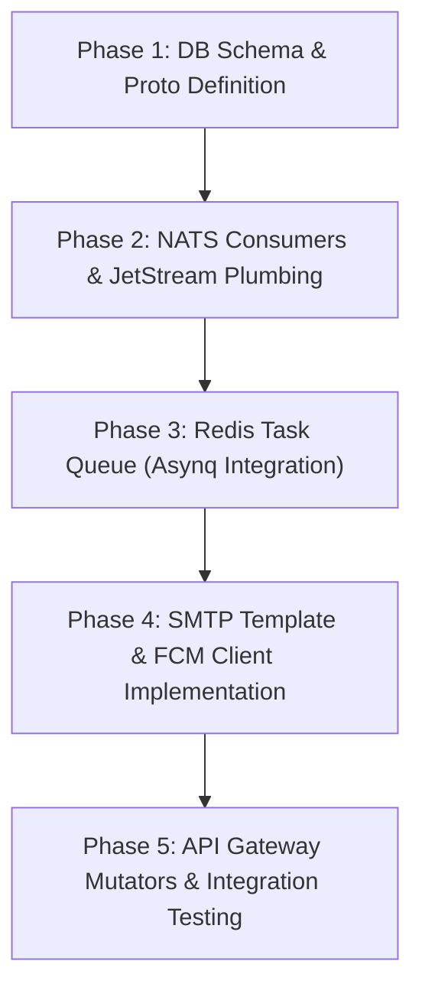

# WeMall — Notification Service Architecture & Implementation Plan

This document outlines the architecture, database schema, event triggers, and implementation strategy for the **WeMall Notification Service**. The service is designed to be a decoupled, event-driven microservice that handles multi-channel communication (Push via **Firebase Cloud Messaging** and Email via **Google SMTP**), manages user subscription preferences, and scales independently.

---

## 1. Architectural Overview

The Notification Service sits behind the **NATS JetStream** event bus. Decoupling notifications from core transactional services (like User, Order, and Payment Services) prevents communication latency or SMTP/FCM outages from blocking the checkout or registration flows.

```
                  ┌──────────────────────────────┐
                  │        NATS JetStream        │
                  │   (wemall.order.created,     │
                  │    wemall.payment.paid...)   │
                  └──────────────┬───────────────┘
                                 │
                                 ▼ (JetStream Push Consumer)
                  ┌──────────────────────────────┐
                  │     Notification Service     │
                  │     (Go · NATS Subscriber)   │
                  └──────────────┬───────────────┘
                                 │
                   Queue Jobs via│ Asynq (Redis)
                                 ▼
                  ┌──────────────────────────────┐
                  │      Worker Queue (Redis)    │
                  └──────────────┬───────────────┘
                                 │
                   ┌─────────────┴─────────────┐
                   ▼                           ▼
      ┌─────────────────────────┐ ┌─────────────────────────┐
      │   Firebase Admin SDK    │ │    net/smtp Client      │
      │    (Google FCM API)     │ │   (Google SMTP Server)  │
      └────────────┬────────────┘ └────────────┬────────────┘
                   │ Push                      │ Email
                   ▼                           ▼
        [Buyer & Seller Devices]        [User Inboxes]
```

### Key Architectural Patterns
1. **At-Least-Once Delivery**: Powered by NATS JetStream ack-mechanisms and local retry queues.
2. **Asynchronous Background Processing**: Using `hibiken/asynq` (Redis-backed queue) for concurrency control, scheduling, and automatic retries with exponential backoff.
3. **Decoupled Database**: The Notification Service owns its database (`wemall_notifications`) containing user device tokens, opt-in/opt-out preferences, and a notification audit log.
4. **Google SMTP Connection Pooling**: Maintains keep-alive connections to Google SMTP (`smtp.gmail.com:587` or `465`) during high-throughput events rather than establishing a TCP/TLS handshake for every single mail.
5. **Token Pruning**: Automatically updates/removes FCM tokens when Google returns `UNREGISTERED` or `INVALID_ARGUMENT`.

---

## 2. Database Schema (`wemall_notifications`)

Each user can have multiple devices (e.g., iPhone, Android tablet) and customized settings for different categories of notifications.

```sql
-- Create Enum for Notification Categories
CREATE TYPE notification_category AS ENUM (
    'transactional',   -- Order status, verification, billing
    'security',        -- Password resets, login alerts
    'low_stock',       -- Inventory alerts (primarily for Sellers)
    'follows',         -- Notifications from followed stores (Buyer)
    'marketing'        -- Promotions, recommendations
);

-- 1. Device Tokens (for Firebase FCM Push Notifications)
CREATE TABLE user_device_tokens (
    id          UUID         PRIMARY KEY DEFAULT gen_random_uuid(),
    user_id     UUID         NOT NULL,               -- Reference to Users DB
    token       TEXT         NOT NULL UNIQUE,        -- FCM Registration Token
    platform    TEXT         NOT NULL,               -- 'ios' | 'android' | 'web'
    device_name TEXT,                                -- e.g. "iPhone 15 Pro"
    created_at  TIMESTAMPTZ  NOT NULL DEFAULT NOW(),
    updated_at  TIMESTAMPTZ  NOT NULL DEFAULT NOW()
);
CREATE INDEX idx_device_tokens_user_id ON user_device_tokens(user_id);

-- 2. User Notification Preferences (Opt-in / Opt-out Settings)
CREATE TABLE user_notification_preferences (
    id                  UUID                  PRIMARY KEY DEFAULT gen_random_uuid(),
    user_id             UUID                  NOT NULL,
    category            notification_category NOT NULL,
    email_enabled       BOOLEAN               NOT NULL DEFAULT TRUE,
    push_enabled        BOOLEAN               NOT NULL DEFAULT TRUE,
    created_at          TIMESTAMPTZ           NOT NULL DEFAULT NOW(),
    updated_at          TIMESTAMPTZ           NOT NULL DEFAULT NOW(),
    UNIQUE(user_id, category)
);
CREATE INDEX idx_preferences_user_id ON user_notification_preferences(user_id);

-- 3. Push Notifications (Stores sent FCM payloads for user in-app notification center)
CREATE TABLE push_notifications (
    id          UUID         PRIMARY KEY DEFAULT gen_random_uuid(),
    user_id     UUID         NOT NULL,               -- Recipient user ID (for querying history)
    token       TEXT         NOT NULL,               -- FCM Registration Token sent to
    title       TEXT         NOT NULL,               -- Extracted from message.notification.title
    body        TEXT         NOT NULL,               -- Extracted from message.notification.body
    payload     JSONB        NOT NULL,               -- Full FCM message JSON (token, notification, data, android/apns configs)
    is_read     BOOLEAN      NOT NULL DEFAULT FALSE, -- Track if user has viewed the notification
    created_at  TIMESTAMPTZ  NOT NULL DEFAULT NOW(),
    read_at     TIMESTAMPTZ                          -- Populated when is_read transitions to true
);
CREATE INDEX idx_push_notifications_user_unread ON push_notifications(user_id) WHERE is_read = FALSE;
CREATE INDEX idx_push_notifications_created_at ON push_notifications(created_at DESC);

-- 4. Notification Log (Audit Trail & Outbox pattern for all channels)
CREATE TYPE delivery_status AS ENUM ('queued', 'sent', 'failed', 'retrying');

CREATE TABLE notification_logs (
    id             UUID             PRIMARY KEY DEFAULT gen_random_uuid(),
    user_id        UUID             NOT NULL,
    category       TEXT             NOT NULL,
    channel        TEXT             NOT NULL,          -- 'email' | 'push'
    recipient      TEXT             NOT NULL,          -- email address or device token
    title          TEXT             NOT NULL,
    content        TEXT             NOT NULL,
    status         delivery_status  NOT NULL DEFAULT 'queued',
    retry_count    INTEGER          NOT NULL DEFAULT 0,
    error_message  TEXT,
    sent_at        TIMESTAMPTZ,
    created_at     TIMESTAMPTZ      NOT NULL DEFAULT NOW(),
    updated_at     TIMESTAMPTZ      NOT NULL DEFAULT NOW()
);
CREATE INDEX idx_notif_logs_user_status ON notification_logs(user_id, status);
CREATE INDEX idx_notif_logs_created_at ON notification_logs(created_at);
```

---

## 3. Subscription & Follow Architecture

WeMall has two types of subscriptions:
1. **Store Follows (B2C Subscriptions)**: Located in the `wemall_sellers` database (`store_follows` table). When a Buyer follows a Seller's store:
   - The user subscribes to new product additions and promotions from that store.
   - **Bridge logic**: When the Product Service publishes `wemall.product.created` or Order/Promotion Service publishes `wemall.promotion.created`, the Notification Service consumes the event, queries the Seller Service for followers via gRPC (a new `ListStoreFollowers` RPC), fetches their preferences/tokens, and queues push/email jobs.
2. **Channel Preferences (User Preferences)**: Managed locally in the `wemall_notifications` DB.

### GraphQL API Schema Extensions (API Gateway)

```graphql
type NotificationPreference {
  category: NotificationCategory!
  emailEnabled: Boolean!
  pushEnabled: Boolean!
}

enum NotificationCategory {
  TRANSACTIONAL
  SECURITY
  LOW_STOCK
  FOLLOWS
  MARKETING
}

extend type Query {
  # Get preference configurations for the logged-in user
  notificationPreferences: [NotificationPreference!]! @hasRole(role: BUYER)
  
  # Fetch past notifications sent to the user (in-app center)
  myNotifications(limit: Int, offset: Int): [NotificationLog!]!
}

extend type Mutation {
  # Register/update a device token for push notifications
  registerDeviceToken(token: String!, platform: String!, deviceName: String): Boolean!
  
  # Deregister a device token (on logout)
  deregisterDeviceToken(token: String!): Boolean!
  
  # Save preference changes
  updateNotificationPreferences(
    category: NotificationCategory!
    emailEnabled: Boolean!
    pushEnabled: Boolean!
  ): NotificationPreference!
}

type NotificationLog {
  id: ID!
  category: String!
  channel: String!
  title: String!
  content: String!
  status: String!
  createdAt: Time!
}
```

---

## 4. Trigger Matrix (All Notifications Needed)

Below is the complete inventory of notifications mapped to their NATS subjects, delivery channels, target actors, and dynamic variables.

| Category | Event Trigger | NATS Subject | Channel | Target | Description | Dynamic Fields / Payload |
|:---|:---|:---|:---|:---|:---|:---|
| **Security** | User Registered | `wemall.user.registered` | Email | Buyer / Seller | Welcome email + account verification link. | `{{.FullName}}`, `{{.VerifyURL}}` |
| **Security** | Password Reset Request | `wemall.user.password_reset` | Email | Buyer / Seller | Password reset link. | `{{.FullName}}`, `{{.ResetURL}}`, `{{.Expiry}}` |
| **Security** | Password Changed Alert | `wemall.user.password_changed` | Email + Push | Buyer / Seller | Alert user of security change. | `{{.Device}}`, `{{.IPAddress}}`, `{{.Time}}` |
| **Transactional** | Order Created / Pending | `wemall.order.created` | Push | Buyer | Confirm receipt of order and show pending payment status. | `{{.OrderNumber}}`, `{{.Total}}`, `{{.PaymentURL}}` |
| **Transactional** | Payment Completed | `wemall.payment.completed` | Email + Push | Buyer | Order confirmation receipt. PDF invoice attached. | `{{.OrderNumber}}`, `{{.Total}}`, `{{.Items}}` |
| **Transactional** | Payment Failed | `wemall.payment.failed` | Push | Buyer | Payment failed. Ask to try again before order expires. | `{{.OrderNumber}}`, `{{.RetryURL}}` |
| **Transactional** | Order Shipped | `wemall.order.shipped` | Push + Email | Buyer | Courier has picked up items. Includes tracking details. | `{{.OrderNumber}}`, `{{.Carrier}}`, `{{.TrackingNumber}}` |
| **Transactional** | Order Delivered | `wemall.order.delivered` | Push | Buyer | Order has arrived. Ask for review / rating. | `{{.OrderNumber}}`, `{{.ReviewURL}}` |
| **Transactional** | Refund Issued | `wemall.payment.refunded` | Email | Buyer | Acknowledge return and refund details (Stripe/PayPal). | `{{.RefundAmount}}`, `{{.OrderNumber}}`, `{{.ETA}}` |
| **Store Management** | Store Status Changed | `wemall.seller.status_changed` | Email + Push | Seller | Notify seller when store is Verified, Suspended, or under Review. | `{{.StoreName}}`, `{{.Status}}`, `{{.Reason}}` |
| **Store Management** | New Order Received | `wemall.order.created` | Push | Seller | Alert seller to prepare items for shipment. | `{{.OrderNumber}}`, `{{.ItemCount}}`, `{{.ShipDeadline}}` |
| **Inventory** | Low Stock Alert | `wemall.inventory.low_stock` | Push + Email | Seller | Inventory of a variant falls below trigger threshold. | `{{.VariantSKU}}`, `{{.RemainingStock}}` |
| **Subscriptions** | Store Follower Update | `wemall.store.post_update` | Push + Email | Buyers (Followers) | Alert followers that a store they follow posted a new product or discount. | `{{.StoreName}}`, `{{.ProductTitle}}`, `{{.Price}}` |
| **Marketing** | Price Drop Alert | `wemall.product.price_dropped` | Push | Watchlist Buyers | Alert buyers who have saved a product that its price dropped. | `{{.ProductTitle}}`, `{{.OldPrice}}`, `{{.NewPrice}}` |
| **Marketing** | Back in Stock | `wemall.inventory.restocked` | Push + Email | Waitlist Buyers | Alert buyers that a sold-out item is now back in stock. | `{{.ProductTitle}}`, `{{.URL}}` |

---

## 5. Firebase Push Notification Integration (FCM)

The Go Firebase Admin SDK is initialized using credentials mounted from Google Cloud Secret Manager or static JSON configs.

### Initialization & Messaging Logic
- **SDK**: `firebase.google.com/go/v4`
- **FCM Client**: `messaging.NewClient(...)`

#### Target JSON Payload Schema
The service will utilize the following standard FCM payload structure:
```json
{
  "message": {
    "token": "FCM_REGISTRATION_TOKEN_HERE",
    "notification": {
      "title": "Breaking News",
      "body": "Check out the latest updates for 2026!"
    },
    "data": {
      "article_id": "12345",
      "category": "sports"
    },
    "android": {
      "ttl": "3600s",
      "priority": "high",
      "notification": {
        "channel_id": "news_channel_01",
        "icon": "ic_notification",
        "color": "#ff0000"
      }
    },
    "apns": {
      "payload": {
        "aps": {
          "alert": {
            "title": "Breaking News",
            "body": "Check out the latest updates for 2026!"
          },
          "badge": 1,
          "sound": "default"
        }
      }
    }
  }
}
```

#### Database Mapping
When a push notification is successfully queued/sent, the service stores a copy of it in the `push_notifications` table using the following mappings:
- **`token`**: Mapped directly from `message.token`
- **`title`**: Extracted from `message.notification.title` (or `message.apns.payload.aps.alert.title` fallback)
- **`body`**: Extracted from `message.notification.body` (or `message.apns.payload.aps.alert.body` fallback)
- **`payload`**: Stores the full FCM structure as a `JSONB` block to retain custom `data`, `android`, and `apns` details.
- **`is_read`**: A boolean flag (`is_read`) defaulted to `FALSE`, which changes to `TRUE` when the user reads the notification in-app.
- **`read_at`**: Set to current timestamp when `is_read` transitions to `TRUE`.

### Multicast Broadcasting (for Store Follower alerts)
When a seller posts a product:
1. Fetch all follower user IDs (from seller service).
2. Fetch all valid device tokens for those user IDs (from `user_device_tokens`).
3. Send using `messaging.SendMulticast()` in batches of 500 (Firebase FCM API limit per call) to maximize performance.
4. Process `MulticastMessageResponse.Responses` to identify tokens that failed with `Unregistered` or `InvalidArgument` and prune/delete them from the local database immediately to save database storage and prevent future latency.

---

## 6. Email Integration via Google SMTP Server

WeMall leverages Google SMTP (`smtp.gmail.com`) for sending transactional emails. The logic utilizes `net/smtp` and standard TLS handshakes.

### Key Performance and Compliance Elements

> [!IMPORTANT]
> Google SMTP accounts have strict daily quotas (typically 2,000 emails/day for Google Workspace, and 500/day for trial/free Gmail). Exceeding this rate leads to temporary suspension (`421 4.7.0 Try again later`).

To implement the "best notification service" while complying with Google SMTP:
1. **Rate Limiting (Token Bucket)**: Implement a strict concurrency governor (e.g., maximum 5 concurrent connections, 10 emails per minute per sender token) within the Asynq/worker processor.
2. **TLS Configuration**:
   - Connection established on port `465` (SMTPS - Implicit TLS) or port `587` (STARTTLS - Explicit TLS).
   - Use Google **App Passwords** or OAuth2 for authentication instead of plain user passwords, maintaining strict IAM scopes.
3. **Template Engine**:
   - HTML emails are rendered dynamically using Go's standard `html/template`.
   - Embed universal CSS variables matching WeMall's high-end glassmorphism design (deep purples/blues, clean sans-serif typography like Inter, status-based badges).
   - Include a base text fallback template in the mail body for older clients (`multipart/alternative`).
4. **Resiliency**: If a SMTP error occurs (like `421` rate limits or socket timeouts), the worker returns a retry signal. Asynq automatically schedules a retry with exponential backoff (e.g., 2m -> 5m -> 15m).

---

## 7. Project Directory Structure

The Notification Service will be placed under `services/notification-service/` inside the WeMall monorepo.

```
services/notification-service/
├── cmd/
│   └── main.go                 # Bootstraps NATS JetStream & Asynq workers
│
├── internal/
│   ├── config/
│   │   └── config.go           # Parses environment configuration (SMTP, Firebase, NATS)
│   │
│   ├── db/                     # sqlc generated database layer
│   │   ├── migrations/         # 001_create_notification_tables.up.sql
│   │   ├── queries/            # queries.sql (token updates, logs, preferences)
│   │   └── sqlc/               # sqlc output code
│   │
│   ├── queue/
│   │   ├── client.go           # Enqueues notification jobs to Redis
│   │   └── worker.go           # Processes jobs (Asynq Handlers)
│   │
│   ├── providers/
│   │   ├── email/
│   │   │   ├── smtp.go         # Google SMTP client pool wrapper
│   │   │   └── templates/      # Base templates (Welcome, Order, Low Stock)
│   │   │       ├── layout.gohtml
│   │   │       ├── welcome.gohtml
│   │   │       └── order_status.gohtml
│   │   │
│   │   └── push/
│   │       └── fcm.go          # Firebase Admin SDK messaging integration
│   │
│   └── handler/
│       └── nats_handler.go     # NATS JetStream event router
│
├── Dockerfile                  # Production builder
├── go.mod                      # Service dependencies
└── sqlc.yaml                   # sqlc configuration mapping to migrations
```

---

## 8. Step-by-Step Implementation Roadmap



### Phase 1: DB Schema & Proto Definition
- Create and run migration scripts on Postgres.
- Define GraphQL mutations/queries in API Gateway and matching gRPC services (if user profile changes are pushed, or for token registration query endpoints).

### Phase 2: NATS Consumers & JetStream Plumbing
- Write NATS subscriber loops listening on subjects defined in the Trigger Matrix.
- Parse NATS payloads into Go structs.

### Phase 3: Redis Task Queue (Asynq Integration)
- Setup Redis instance for queue storage.
- Implement queue handlers in `internal/queue/worker.go` that receive notification payloads and invoke delivery providers.

### Phase 4: SMTP Template & FCM Client Implementation
- Build HTML layouts and wire up the `net/smtp` connection-pooling client.
- Mount Firebase JSON service accounts and implement FCM push dispatching.

### Phase 5: Verification & Integration Testing
- Create mock tests to simulate high-volume orders.
- Validate token-pruning edge cases (simulating unregistered FCM tokens) and SMTP failure retry paths.
