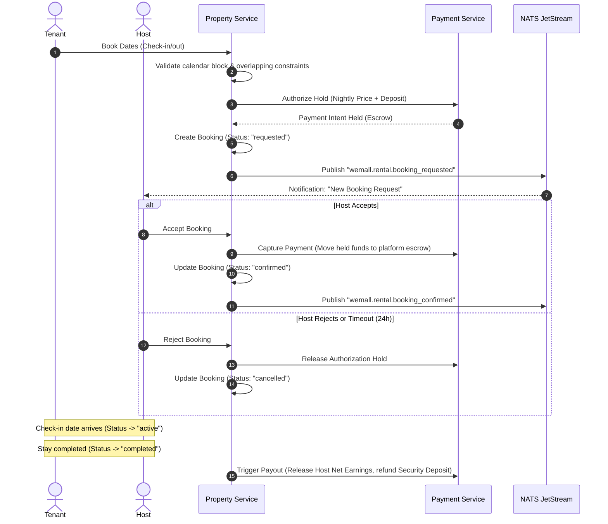
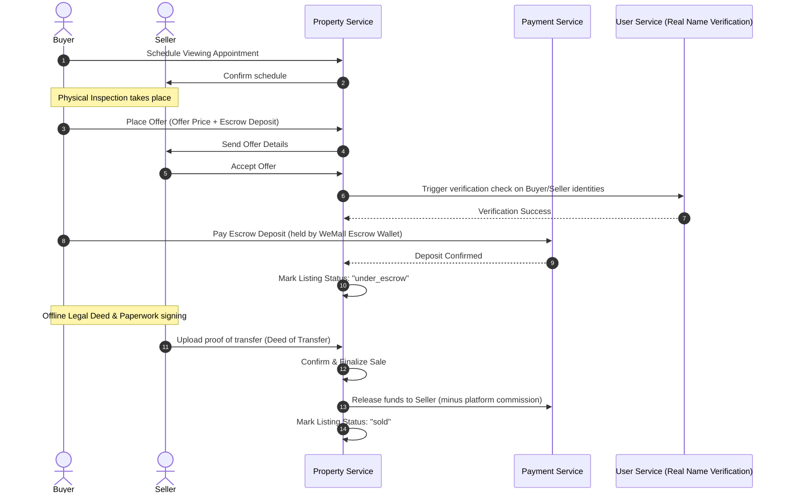

# WeMall — Property Rental & Sales Service Architecture & Design Plan

This document outlines the architecture, database schema, GIS geolocation search mechanics, core workflows, and integration path for the **WeMall Property Rental and Sales Service**. 

Designed using industry-standard patterns from Airbnb and real-estate platforms, this microservice supports **short-term/long-term property rentals** and **real estate property sales (buying/selling)**, utilizing **PostGIS** for high-performance spatial querying and geolocation.

---

## 1. Architectural Overview

The Property Service is a dedicated microservice (`property-service`) in the WeMall ecosystem. It sits behind the **API Gateway** (integrating into the schema-first GraphQL API via `gqlgen`) and communicates asynchronously with other services using **NATS JetStream** and synchronously via **gRPC**.

```
                      ┌────────────────────────────────────────┐
                      │          API Gateway (GraphQL)         │
                      └────┬───────────────────────────────┬───┘
                           │                               │
       (Buyer/Tenant App)  │                               │ (Host/Seller App)
                           ▼                               ▼
        ┌───────────────────────┐             ┌───────────────────────┐
        │   Guests & Buyers     │             │    Hosts & Sellers    │
        └───────────┬───────────┘             └───────────┬───────────┘
                    │                                     │
                    ▼                                     ▼
   ┌─────────────────────────────────────────────────────────────────┐
   │                  WeMall Property Service (Go)                   │
   │                                                                 │
   │  ┌──────────────────┐  ┌──────────────────┐  ┌───────────────┐  │
   │  │  Booking Engine  │  │   Offers Engine  │  │ Spatial Search│  │
   │  │  (Rentals/Blocks)│  │ (Sales/Escrow)   │  │ (PostGIS/Redis)  │
   │  └────────┬─────────┘  └──────────────────┘  └───────┬───────┘  │
   └───────────┼──────────────────────────────────────────┼──────────┘
               │                                          │
               ▼ gRPC Integrations                        ▼ Output
   ┌───────────────────────────────────┐        ┌──────────────────┐
   │ User Service (Verification check) │        │ Geolocation API  │
   │ Payment Service (Escrow Wallet)   │        │   (JSON/GeoJSON) │
   └───────────┬───────────────────────┘        └──────────────────┘
               │
               ▼ Publishes Events
   ┌─────────────────────────────────────────────────────────────────┐
   │                      NATS JetStream Event Bus                   │
   │           (wemall.property.created, wemall.rental.booked,       │
   │            wemall.sales.offer_placed, wemall.sales.sold...)     │
   └───────────────────────────────┬─────────────────────────────────┘
                                   │
                                   ▼ (JetStream Subscriber)
   ┌─────────────────────────────────────────────────────────────────┐
   │               Decoupled Services Integration                    │
   │                                                                 │
   │ ┌───────────────────────┐ ┌───────────────────┐ ┌─────────────┐ │
   │ │ Notification Service  │ │   Review Service  │ │ Chat Service│ │
   │ │  (Email/Push Alert)   │ │  (Rating Sync)    │ │(Buyer-Host) │ │
   │ └───────────────────────┘ └───────────────────┘ └─────────────┘ │
   └─────────────────────────────────────────────────────────────────┘
```

### Architectural Core Decisions
1. **Service Isolation**: Rather than extending `product-service`, property listings require specialized business logic (calendars, booking states, spatial coordinates, viewing schedules, and offers). A dedicated `property-service` prevents catalog pollution.
2. **Database Isolation**: A dedicated PostgreSQL instance (`postgres-property` on port `5446`) with the PostGIS extension enabled.
3. **Data Hydration**: High-traffic property details are cached using Redis geospatial indexes (`GEOSEARCH`) for fast radial searches and autocomplete, while the source of truth remains PostGIS.
4. **Consistency Model**: Event-driven eventual consistency via NATS JetStream for notifications, chat initiation, review creation, and seller dashboard updates.

---

## 2. Database Schema (`wemall_properties`)

The database uses PostgreSQL 16 with PostGIS. It separates the physical property entity from its listing state, enabling the same property to transition between rental and sale types over time, or be re-listed without duplicating geographical data.

```sql
-- Enable PostGIS extension for spatial queries
CREATE EXTENSION IF NOT EXISTS postgis;

-- Create Enums
CREATE TYPE property_type AS ENUM (
    'apartment', 'house', 'villa', 'condo', 'townhouse', 'cabin', 'studio', 'land'
);

CREATE TYPE listing_type AS ENUM (
    'rental', 'sale'
);

CREATE TYPE listing_status AS ENUM (
    'draft', 'pending_approval', 'active', 'suspended', 'sold', 'rented', 'inactive'
);

CREATE TYPE booking_status AS ENUM (
    'pending_payment', 'requested', 'confirmed', 'cancelled', 'active', 'completed', 'disputed'
);

CREATE TYPE offer_status AS ENUM (
    'submitted', 'accepted', 'rejected', 'under_escrow', 'funds_released', 'cancelled', 'disputed'
);

CREATE TYPE appointment_status AS ENUM (
    'scheduled', 'confirmed', 'completed', 'cancelled', 'no_show'
);

-- 1. Properties Table (Core Entity)
CREATE TABLE properties (
    id                  UUID            PRIMARY KEY DEFAULT gen_random_uuid(),
    owner_id            UUID            NOT NULL, -- Reference to User Service (Host / Seller)
    type                property_type   NOT NULL,
    title               VARCHAR(255)    NOT NULL,
    description         TEXT            NOT NULL,
    address_line1       VARCHAR(255)    NOT NULL,
    address_line2       VARCHAR(255),
    city                VARCHAR(100)    NOT NULL,
    state_province      VARCHAR(100)    NOT NULL,
    country             VARCHAR(100)    NOT NULL,
    postal_code         VARCHAR(20),
    -- Geo Location point (using WGS 84, SRID 4326)
    location            GEOMETRY(Point, 4326) NOT NULL,
    bedroom_count       INT             NOT NULL DEFAULT 0,
    bathroom_count      DECIMAL(3,1)    NOT NULL DEFAULT 0.0,
    max_guests          INT             NOT NULL DEFAULT 0, -- Relevant for rentals
    square_meters       DECIMAL(8,2)    NOT NULL DEFAULT 0.0, -- Relevant for sales/rentals
    is_verified         BOOLEAN         NOT NULL DEFAULT FALSE,
    created_at          TIMESTAMPTZ     NOT NULL DEFAULT NOW(),
    updated_at          TIMESTAMPTZ     NOT NULL DEFAULT NOW()
);

-- Spatial index for fast geographic queries
CREATE INDEX idx_properties_location ON properties USING GIST(location);
CREATE INDEX idx_properties_owner ON properties(owner_id);

-- 2. Property Images
CREATE TABLE property_images (
    id            UUID          PRIMARY KEY DEFAULT gen_random_uuid(),
    property_id   UUID          NOT NULL REFERENCES properties(id) ON DELETE CASCADE,
    url           TEXT          NOT NULL,
    display_order INT           NOT NULL DEFAULT 0,
    is_cover      BOOLEAN       NOT NULL DEFAULT FALSE,
    created_at    TIMESTAMPTZ   NOT NULL DEFAULT NOW()
);
CREATE INDEX idx_property_images_property ON property_images(property_id);

-- 3. Property Amenities
CREATE TABLE property_amenities (
    id            UUID          PRIMARY KEY DEFAULT gen_random_uuid(),
    property_id   UUID          NOT NULL REFERENCES properties(id) ON DELETE CASCADE,
    name          VARCHAR(100)  NOT NULL, -- e.g., 'WiFi', 'Pool', 'Air Conditioning'
    category      VARCHAR(50)   NOT NULL, -- e.g., 'utilities', 'luxury', 'safety'
    created_at    TIMESTAMPTZ   NOT NULL DEFAULT NOW()
);
CREATE UNIQUE INDEX idx_property_amenities_unique ON property_amenities(property_id, name);

-- 4. Listings Table (Connects properties to market states)
CREATE TABLE listings (
    id              UUID            PRIMARY KEY DEFAULT gen_random_uuid(),
    property_id     UUID            NOT NULL REFERENCES properties(id) ON DELETE CASCADE,
    type            listing_type    NOT NULL,
    status          listing_status  NOT NULL DEFAULT 'draft',
    base_price      DECIMAL(12,2)   NOT NULL, -- Nightly rate for rental, Total price for sale
    currency        VARCHAR(3)      NOT NULL DEFAULT 'USD',
    is_instant_book BOOLEAN         NOT NULL DEFAULT FALSE, -- Only for rentals
    created_at      TIMESTAMPTZ     NOT NULL DEFAULT NOW(),
    updated_at      TIMESTAMPTZ     NOT NULL DEFAULT NOW()
);
CREATE INDEX idx_listings_property ON listings(property_id);
CREATE INDEX idx_listings_status_type ON listings(status, type);

-- 5. Rental Metadata (Specific to short-term/long-term rentals)
CREATE TABLE rental_listings_meta (
    listing_id        UUID            PRIMARY KEY REFERENCES listings(id) ON DELETE CASCADE,
    cleaning_fee      DECIMAL(10,2)   NOT NULL DEFAULT 0.00,
    security_deposit  DECIMAL(10,2)   NOT NULL DEFAULT 0.00,
    min_nights        INT             NOT NULL DEFAULT 1,
    max_nights        INT             NOT NULL DEFAULT 90,
    check_in_time     TIME            NOT NULL DEFAULT '15:00:00',
    check_out_time    TIME            NOT NULL DEFAULT '11:00:00'
);

-- 6. Sales Metadata (Specific to property buying/selling)
CREATE TABLE sales_listings_meta (
    listing_id             UUID            PRIMARY KEY REFERENCES listings(id) ON DELETE CASCADE,
    escrow_deposit_percent DECIMAL(5,2)    NOT NULL DEFAULT 10.00, -- e.g. 10% deposit required
    agent_commission_rate  DECIMAL(5,2)    NOT NULL DEFAULT 3.00,  -- e.g. 3% standard rate
    includes_furniture     BOOLEAN         NOT NULL DEFAULT FALSE,
    year_built             INT,
    property_tax_annual    DECIMAL(12,2)
);

-- 7. Rental Bookings Table (Airbnb style reservation calendar)
CREATE TABLE rental_bookings (
    id                UUID            PRIMARY KEY DEFAULT gen_random_uuid(),
    listing_id        UUID            NOT NULL REFERENCES listings(id),
    tenant_id         UUID            NOT NULL, -- Reference to User Service (Guest)
    start_date        DATE            NOT NULL,
    end_date          DATE            NOT NULL,
    nightly_price     DECIMAL(12,2)   NOT NULL,
    cleaning_fee      DECIMAL(10,2)   NOT NULL DEFAULT 0.00,
    security_deposit  DECIMAL(10,2)   NOT NULL DEFAULT 0.00,
    total_price       DECIMAL(12,2)   NOT NULL,
    status            booking_status  NOT NULL DEFAULT 'requested',
    payment_intent_id VARCHAR(255),
    created_at        TIMESTAMPTZ     NOT NULL DEFAULT NOW(),
    updated_at        TIMESTAMPTZ     NOT NULL DEFAULT NOW(),
    -- Exclude overlapping active bookings on database level (PostgreSQL Exclude Constraint)
    CONSTRAINT no_overlapping_bookings EXCLUDE USING gist (
        listing_id WITH =,
        daterange(start_date, end_date, '[]') WITH &&
    ) WHERE (status IN ('confirmed', 'active'))
);
CREATE INDEX idx_bookings_tenant ON rental_bookings(tenant_id);
CREATE INDEX idx_bookings_listing ON rental_bookings(listing_id);

-- 8. Sales Offers Table (Real estate bids/contracts)
CREATE TABLE sales_offers (
    id                 UUID            PRIMARY KEY DEFAULT gen_random_uuid(),
    listing_id         UUID            NOT NULL REFERENCES listings(id),
    buyer_id           UUID            NOT NULL, -- Reference to User Service
    offer_price        DECIMAL(12,2)   NOT NULL,
    escrow_deposit_paid DECIMAL(12,2)  NOT NULL DEFAULT 0.00,
    status             offer_status    NOT NULL DEFAULT 'submitted',
    conditions_text    TEXT,           -- e.g. "Subject to structural survey"
    expiration_date    TIMESTAMPTZ     NOT NULL,
    created_at         TIMESTAMPTZ     NOT NULL DEFAULT NOW(),
    updated_at         TIMESTAMPTZ     NOT NULL DEFAULT NOW()
);
CREATE INDEX idx_offers_buyer ON sales_offers(buyer_id);
CREATE INDEX idx_offers_listing ON sales_offers(listing_id);

-- 9. Viewing Appointments (Physical property inspections)
CREATE TABLE viewing_appointments (
    id             UUID               PRIMARY KEY DEFAULT gen_random_uuid(),
    listing_id     UUID               NOT NULL REFERENCES listings(id),
    client_id      UUID               NOT NULL, -- User wanting to inspect
    host_id        UUID               NOT NULL, -- Owner/Agent showing the property
    scheduled_time TIMESTAMPTZ        NOT NULL,
    status         appointment_status NOT NULL DEFAULT 'scheduled',
    notes          TEXT,
    created_at     TIMESTAMPTZ        NOT NULL DEFAULT NOW(),
    updated_at     TIMESTAMPTZ        NOT NULL DEFAULT NOW()
);
CREATE INDEX idx_appointments_client ON viewing_appointments(client_id);
CREATE INDEX idx_appointments_host ON viewing_appointments(host_id);
CREATE INDEX idx_appointments_time ON viewing_appointments(scheduled_time);
```

---

## 3. GIS & Geolocation Engine Mechanics

Spatial performance is critical for an Airbnb-style interface. WeMall Property uses **PostGIS SRID 4326 (WGS 84)** for geospatial calculations. Coordinates are input as Longitude/Latitude (X/Y) points.

### A. Spatial Indexing
Geography and spatial metrics are processed using a **Generalized Search Tree (GiST)** index over the spatial column:
```sql
CREATE INDEX idx_properties_location ON properties USING GIST(location);
```
*Rationale*: A B-Tree index cannot handle 2D proximity indexing. GiST decomposes space hierarchically (using bounding boxes), accelerating geographic containment and distance lookups.

### B. Core Spatial Queries (Go / SQL)

#### 1. Radial Search (Nearest Listings in X meters)
Returns all active property listings within a given distance of a coordinate, sorted by distance.
```sql
-- name: SearchNearbyListings :many
SELECT 
    p.id, 
    p.title, 
    p.type,
    p.bedroom_count,
    p.bathroom_count,
    ST_Y(p.location::geometry) AS latitude,
    ST_X(p.location::geometry) AS longitude,
    l.id AS listing_id,
    l.type AS listing_type,
    l.base_price,
    l.currency,
    ST_Distance(
        p.location, 
        ST_SetSRID(ST_MakePoint($1::double precision, $2::double precision), 4326)::geography
    ) AS distance_meters
FROM properties p
JOIN listings l ON p.id = l.property_id
WHERE l.status = 'active'
  AND ST_DWithin(
      p.location, 
      ST_SetSRID(ST_MakePoint($1::double precision, $2::double precision), 4326)::geography, 
      $3::double precision -- Search radius in meters
  )
ORDER BY distance_meters ASC
LIMIT $4 OFFSET $5;
```

#### 2. Bounding Box Search (Map Viewport Fetching)
Fetches properties visible inside a user's current map viewport (drag and zoom on map).
```sql
-- name: GetListingsInViewport :many
SELECT 
    p.id, p.title, p.location, l.id AS listing_id, l.base_price, l.type AS listing_type
FROM properties p
JOIN listings l ON p.id = l.property_id
WHERE l.status = 'active'
  AND p.location && ST_MakeEnvelope(
      $1::double precision, -- Min Longitude (West)
      $2::double precision, -- Min Latitude (South)
      $3::double precision, -- Max Longitude (East)
      $4::double precision, -- Max Latitude (North)
      4326
  );
```
*Note*: The `&&` operator checks if the geometry bounding box overlaps with the envelope, which is extremely fast because it uses the GiST index directly without calculating exact shapes.

#### 3. Spatial Aggregation / Clustering (Heatmaps)
To support large density displays (zoomed out state), points are grouped into geographical boxes:
```sql
-- Group listings by a 0.05-degree grid (approx 5.5km) to return clusters
-- name: GetListingClusters :many
SELECT 
    ST_AsText(ST_Centroid(ST_Collect(p.location))) AS cluster_center,
    COUNT(l.id) AS listing_count,
    AVG(l.base_price) AS average_price
FROM properties p
JOIN listings l ON p.id = l.property_id
WHERE l.status = 'active'
GROUP BY ST_SnapToGrid(p.location, 0.05);
```

---

## 4. Core Workflows

### Workflow A: Airbnb-Style Booking & Escrow (Rentals)
A standard booking cycle handles calendar blocks, payment authorization, and payout distribution.



### Workflow B: Property Buying, Offers, and Viewing (Sales)
Property sales run on a longer timeline requiring physical viewing slots, earnest deposits in escrow, and real-name verification checks.



---

## 5. Microservices Integration & Event Mesh

The `property-service` interacts with existing services via standard protobuf definitions.

### NATS JetStream Events (Published)
- `wemall.property.created`: Fired when a new property is registered. Hydrates search index.
- `wemall.rental.booking_created`: Fires booking pipeline, notifications.
- `wemall.rental.booking_confirmed`: Fires check-in timeline workflows.
- `wemall.sales.offer_placed`: Notifies sellers of a new bid.
- `wemall.sales.offer_accepted`: Moves listing to escrow lock.
- `wemall.property.verified`: Fired when admin verifies property deeds/certificates.

### gRPC Integrations (Synchronous Calls)
- **`user-service`**: Resolves guest/host profiles, fetches verification badges (`User.IsVerified`).
- **`payment-service`**: Configures multi-currency transactions, processes credit/debit authorizations, holds escrow deposits, and releases funds.
- **`review-service`**: Handles reviews for host-to-tenant, tenant-to-host, and buyer-to-property.

---

## 6. Scale, Caching, and Performance Optimizations

1. **Availability Grid (Calendar Performance)**:
   - Calendar overlaps are checked on the database level via PostgreSQL range exclusion indexes (`daterange`).
   - For fast searches (e.g. "Harare rentals available from July 15 to July 20"), listings are pre-filtered using a **bitmap index** or caching listing availability in Redis. In Redis, each listing has a Bitfield where each bit represents a day of the year (0 = available, 1 = booked). Overlapping checks are done with high-performance bitwise `AND` operators.
2. **Geographical Caching**:
   - Geohashing (e.g., precision level 6, covering ~1.2km) is calculated on creation and saved.
   - Nearby searches utilize Redis `GEOSEARCH` to find property IDs within a range, then fetch full details from the database.
3. **Read Replicas & Cluster Clustering**:
   - Since search traffic is read-heavy (100:1 read-to-write ratio), spatial search queries run on PostGIS Read Replicas.
4. **Hybrid Payments**:
   - **Rentals**: Small payments & security deposits support both Stripe and Mobile Money (EcoCash) directly.
   - **Sales**: Earnest deposits (e.g. 5-10%) support mixed card payments or EcoCash. However, the final deed settlement is handled via secure bank wire instructions uploaded to the platform's escrow dashboard, with WeMall verifying receipt before unlocking deed transfers.
5. **Two-Stage Property Verification**:
   - Listings are created instantly with a default status of `unverified` but remain searchable.
   - To obtain a "Deed Verified" badge and higher SEO/Search ranking weight, hosts/sellers upload official land registry certificates which are verified by WeMall admins via the admin-service.
