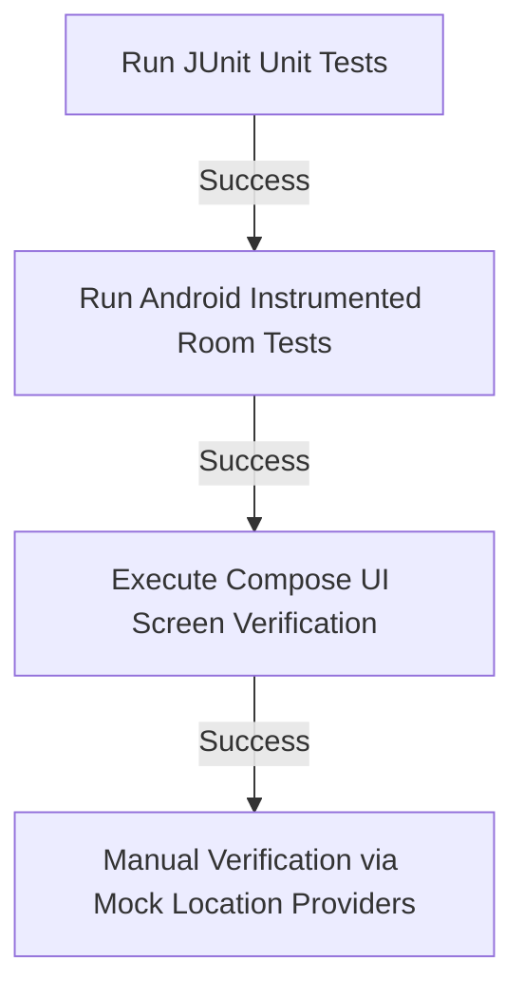

# WeFast User Delivery Mobile Application: Enterprise-Grade Architecture & Implementation Plan

This document details the frontend architecture, codebase organization, backend integrations, testing frameworks, and deployment roadmap for **WeFast**, WeMall's user-facing delivery mobile client. 

Built using Kotlin and Jetpack Compose, this enterprise application utilizes Clean Architecture and MVI (Model-View-Intent) to ensure high testability (TDD), modularity, offline resilience, and smooth real-time tracking interfaces.

---

## 1. Architectural Blueprint (Clean Architecture & MVI)

The WeFast application enforces a strict unidirectional dependency rule: **Presentation/UI Layer → Domain Layer ← Data Layer**.

```
                ┌──────────────────────────────────────────────┐
                │             PRESENTATION LAYER               │
                │    (Compose UI, ViewModels, UI States)       │
                └──────────────────────┬───────────────────────┘
                                       │
                                       ▼ (Uses interfaces)
                ┌──────────────────────────────────────────────┐
                │                 DOMAIN LAYER                 │
                │      (Pure Kotlin: UseCases, Models)         │
                └──────────────────────▲───────────────────────┘
                                       │
                                       │ (Implements interfaces)
                ┌──────────────────────┴───────────────────────┘
                │                  DATA LAYER                  │
                │     (Apollo, Room, Google Pay, Mappers)      │
                └──────────────────────────────────────────────┘
```

### 1.1 Architectural Pillars
1. **Zero Framework Dependencies in Domain**: The Domain layer consists of pure, platform-independent Kotlin code. It defines core business logic (e.g., dimensions validation, volume calculations) and Repository Interfaces. It cannot import Android SDK packages (like `Context` or `LiveData`), ensuring it can be unit-tested in milliseconds on any JVM.
2. **Unidirectional Data Flow (MVI)**: 
   - **Intent**: Representational user events (e.g., `ConfirmShipment`, `TrackPackage`).
   - **State**: A single, immutable UI State flow representing the screen state.
   - **Effect**: One-off side effects (e.g., navigate, show toast) dispatched via a shared channel.
3. **Offline-First Storage Policy**: The app acts as an offline-first client. All queries (e.g., active tracking history, saved addresses) load from the local **Room Database** first. A background synchronization manager runs updates against the network via work scheduling.
4. **Multi-Module Separation**: To facilitate parallel development and scale compilation speeds in large teams, the project is structured into modular feature blocks and shared core modules.

---

## 2. Directory Structure & Modularization Strategy

The codebase is organized into multi-module Gradle subprojects, separating cross-cutting concerns from feature-specific packages.

```
wefast-android/
├── build.gradle.kts                   # Root build script
├── settings.gradle.kts                # Subproject registrations
├── gradle/
│   └── libs.versions.toml             # Standardized Version Catalog
│
├── core/                              # Shared infrastructure modules
│   ├── designsystem/                  # Theme, colors (Orange Accent), common compose UI widgets
│   ├── network/                       # Apollo GraphQL client setup, JWT interceptors, WebSocket subscriptions
│   ├── database/                      # Room database setups, shared migrations, local storage
│   ├── location/                      # FusedLocationProvider wrapper, geofencing utilities
│   └── test/                          # Shared test utilities (Coroutines Rules, Mock Helpers)
│
└── features/                          # Feature-specific modules
    ├── auth/                          # Phone OTP Login & Google OAuth onboarding
    ├── send/                          # C2C shipping order builder, Maps geocoding, payment integration
    ├── tracking/                      # Active delivery list, visual timeline, real-time rider map
    └── station/                       # Interactive Station search maps, capacity metrics, pickup OTPs
```

### Core Architecture Layer Breakdowns (Example: `features/send`)
Inside the `features/send` module, the Clean Architecture folders are laid out as:
*   `com.wefast.send.domain`:
    *   `model/`: `ParcelInfo`, `DeliveryEstimate`, `Recipient`
    *   `repository/`: `SendRepository` (interface)
    *   `usecase/`: `EstimateRatesUseCase`, `CreateShipmentUseCase`
*   `com.wefast.send.data`:
    *   `repository/`: `SendRepositoryImpl`
    *   `mapper/`: `DtoToDomainMapper`
    *   `remote/`: Apollo GraphQL client wrappers
*   `com.wefast.send.presentation`:
    *   `ui/`: `SendShipmentScreen`, `MapPinPicker`
    *   `viewmodel/`: `SendShipmentViewModel`, `SendUiState`, `SendIntent`

---

## 3. Technology Stack & Enterprise Dependencies

The libraries list utilizes current, official libraries to guarantee performance and long-term support.

| Category | Library / Tool | Description & Rationale |
| :--- | :--- | :--- |
| **Language** | Kotlin 2.x | Modern compiler, strong type-safety, native Coroutine and Flow bindings. |
| **UI Framework** | Jetpack Compose (M3) | Declarative UI toolkit. Integrates responsive navigation and window-size adapters. |
| **Dependency Injection** | Hilt | Standard Dagger wrappers for Android. Manages scoping for ViewModels and Singletons. |
| **Network Client** | Apollo Kotlin | Generates type-safe models from `.graphql` files. Supports WebSocket subscriptions. |
| **Local Database** | Room | SQLite wrapper with schema compilation verification and reactive Flow querying. |
| **Location Tracking** | Google Play Location | FusedLocationProviderClient for high-accuracy GPS and geofence tracking. |
| **Payment SDKs** | Google Pay & Stripe SDK | Safe client tokenization and 3D Secure verification flows. |
| **Testing** | JUnit 5 & MockK | Modern testing runner with native coroutine and mocking support. |
| **Flow Assertions** | Turbine | Streamlines Coroutines Flow state assertion without manual channel collections. |

---

## 4. GraphQL API Connections & Integration Map

The application integrates with WeMall's API Gateway. The following schema mappings connect frontend flows to backend services.

```
                          ┌───────────────────────┐
                          │ WeMall API Gateway    │
                          │ (GraphQL Engine)      │
                          └──────┬─────────▲──────┘
                                 │         │
               HTTP Queries      │         │ WebSocket
               & Mutations       │         │ Subscriptions
                                 ▼         │
                      ┌────────────────────┴──────┐
                      │    Apollo Client Engine   │
                      └──────────┬─────────▲──────┘
                                 │         │
                   Local Read    │         │ Sync / Write
                                 ▼         │
                      ┌────────────────────┴──────┐
                      │    Room Local DB Cache    │
                      └──────────┬─────────▲──────┘
                                 │         │ MVI State
                                 ▼         │ Updates
                      ┌────────────────────┴──────┐
                      │    Jetpack Compose UI     │
                      └───────────────────────────┘
```

### 4.1 Onboarding & Address Mapping
*   **Authentication**:
    - `buyerSendOTP(phone: String)` Mutation: Dispatches verification SMS codes.
    - `buyerVerifyOTP(phone: String, code: String)` Mutation: Exchanges OTP for JWT access/refresh tokens.
*   **Saved Address Book**:
    - `ListAddresses` / `CreateAddress` Queries: Manage user address shortcuts.

### 4.2 C2C Package Shipment (`features/send`)
*   **Station Queries**:
    - `nearbyStations(latitude, longitude, radiusMeters)` Query: Fetches neighborhood pickup points.
*   **Creation & Estimation**:
    - `createPersonalDelivery(input: PersonalDeliveryInput!)` Mutation: Sets up the C2C delivery order and receives the Stripe/Google Pay client secret tokens.

### 4.3 Track and Trace Lifecycle (`features/tracking`)
*   **Audit Timeline Logs**:
    - `trackPackage(trackingNumber)` Query: Resolves full structural status changes (e.g., `AWAITING_PICKUP` -> `IN_TRANSIT` -> `DELIVERED`).
*   **Real-Time Movement**:
    - `courierLocationUpdated(deliveryOrderId: ID!)` Subscription (WebSocket): Receives continuous geolocation coordinates of active crowdsourced couriers.

---

## 5. Critical Loopholes & Enterprise Resolutions

During design evaluation, several critical loopholes in standard mobile client architectures have been resolved to guarantee an enterprise-grade UX.

### Loophole 1: Payment Intent Status Inconsistency (Race Conditions)
*   **The Issue**: When the user completes payment on the Google Pay/Stripe sheet, if the mobile app crashes or the network drops before the app can dispatch the `processPayment` mutation, the user is billed, but the delivery order remains stuck in `created` (unpaid) status on the database.
*   **The Resolution**: The client must not drive the final order status transition. Payment providers must be configured with a backend Webhook (`payment_intent.succeeded`). The payment gateway calls this webhook directly on success, moving the status to `assigned` asynchronously. The mobile app simply listens to a WebSocket subscription for the status update or calls a local check-status API on resume.

### Loophole 2: Offline Courier OTP Validation for Package Pickup
*   **The Issue**: When a user drops off or picks up a package at a WeMall Station, they need to show the 6-digit OTP verification code. If the station is inside a basement or has poor network coverage, the user cannot retrieve the code from the server.
*   **The Resolution**: Once the package status transitions to `ARRIVED_AT_STATION` while the user is online, the `station_packages` Room database entity stores the high-entropy `verification_code` locally. The UI renders the cached code offline.

### Loophole 3: High Resource & Battery Drain during Map Polling
*   **The Issue**: Traditional mobile tracking apps poll the courier's location every 5 seconds, resulting in massive network overhead and rapid battery drainage.
*   **The Resolution**: Use Apollo GraphQL WebSockets subscriptions for incoming updates so the network socket remains idle unless a new position coordinate is published. For the rider/courier tracking (if embedded), implement the Android Activity Recognition API to adjust GPS update frequencies dynamically (e.g., check every 5 seconds when moving at >15km/h, and drop to every 5 minutes when stationary).

---

## 6. Test-Driven Development (TDD) Blueprint

To guarantee 100% reliability of delivery calculations and state transitions, WeFast enforces a strict TDD strategy using the **Red-Green-Refactor** pattern.

### 6.1 Domain Layer Test Blueprint (TDD Target - Red/Green)
Below is the unit test for creating a personal delivery request, validating inputs (e.g., rejecting negative dimensions/weights) before calling the repository network bridge.

```kotlin
class CreateShipmentUseCaseTest {

    private val repository: SendRepository = mockk()
    private lateinit var createShipmentUseCase: CreateShipmentUseCase

    @BeforeEach
    fun setUp() {
        createShipmentUseCase = CreateShipmentUseCase(repository)
    }

    @Test
    fun `when parcel weight is negative or zero, returns validation failure`() = runTest {
        // Arrange
        val invalidInput = createMockDeliveryInput(weightKg = -2.5)

        // Act
        val result = createShipmentUseCase(invalidInput)

        // Assert
        assertTrue(result.isFailure)
        assertEquals("Weight must be greater than zero", result.exceptionOrNull()?.message)
        verify { repository wasNot Called }
    }

    @Test
    fun `when parcel dimensions exceed maximum constraints, returns dimensions error`() = runTest {
        // Arrange
        val oversizedInput = createMockDeliveryInput(lengthCm = 250) // Max limit is 150cm

        // Act
        val result = createShipmentUseCase(oversizedInput)

        // Assert
        assertTrue(result.isFailure)
        assertEquals("Parcel dimensions exceed maximum size constraints", result.exceptionOrNull()?.message)
    }

    @Test
    fun `when input is valid, returns success invoice from repository`() = runTest {
        // Arrange
        val validInput = createMockDeliveryInput()
        val mockInvoice = DeliveryInvoice(orderId = "o1", fee = 15.50, secret = "sec_123")
        coEvery { repository.createDelivery(validInput) } returns Result.success(mockInvoice)

        // Act
        val result = createShipmentUseCase(validInput)

        // Assert
        assertTrue(result.isSuccess)
        assertEquals(mockInvoice, result.getOrNull())
        coVerify(exactly = 1) { repository.createDelivery(validInput) }
    }
}
```

### 6.2 ViewModel Presentation MVI State Test Blueprint
Using **Turbine** to collect the state flow, this test asserts that firing a `TrackPackage` Intent changes the loading states and populates tracking logs in correct sequence.

```kotlin
@OptIn(ExperimentalCoroutinesApi::class)
class TrackingViewModelTest {

    private val testDispatcher = StandardTestDispatcher()
    private val trackPackageUseCase: TrackPackageUseCase = mockk()
    private lateinit var viewModel: TrackingViewModel

    @BeforeEach
    fun setUp() {
        Dispatchers.setMain(testDispatcher)
        viewModel = TrackingViewModel(trackPackageUseCase)
    }

    @AfterEach
    fun tearDown() {
        Dispatchers.resetMain()
    }

    @Test
    fun `tracking package updates state to loading then success on valid tracking code`() = runTest {
        // Arrange
        val trackingNo = "WM-12345"
        val mockResult = createMockDeliveryOrder(trackingNo)
        coEvery { trackPackageUseCase(trackingNo) } returns flowOf(Result.success(mockResult))

        // Act & Assert using Turbine
        viewModel.uiState.test {
            // Assert Initial state is idle
            val initial = awaitItem()
            assertFalse(initial.isLoading)
            assertNull(initial.deliveryOrder)

            // Act: Fire track package intent
            viewModel.handleIntent(TrackingIntent.TrackPackage(trackingNo))

            // Assert State 1: Transitions to Loading
            val loadingState = awaitItem()
            assertTrue(loadingState.isLoading)

            // Assert State 2: Receives Delivery order details, stops loading
            val successState = awaitItem()
            assertFalse(successState.isLoading)
            assertEquals(mockResult, successState.deliveryOrder)
            assertNull(successState.error)

            cancelAndConsumeRemainingEvents()
        }
    }
}
```

---

## 7. Verification Plan & Pipeline



### 7.1 Automated Testing Actions
*   **Unit Tests**: Run tests via `./gradlew test` (Target: JVM). Tests cover Domain use cases, ViewModels MVI state loops, and mapper conversions.
*   **Instrumented Cache Tests**: Run Room database verification in the android emulator via `./gradlew connectedAndroidTest` to check persistence and schema migration.

### 7.2 Manual Verification Steps
1.  **Mock Location Testing**: Developers inject mocked GPS coordinates using Android Mock Location Providers (via Developer Options) to test route maps, distance calculations, and proximity boundaries.
2.  **Network Throttle Simulation**: Test the offline caching layers by running the application inside an emulator set to "Offline" or throttled to "Slow 3G" speeds to ensure visual status banners and Room caching operate smoothly without freezing.
3.  **Payment Sandbox Checks**: Execute checkout payments using Google Pay and Stripe Test Cards (using dummy zip codes and 3DS challenge pages) to verify webhook reconciliation and state updates on order dashboards.
